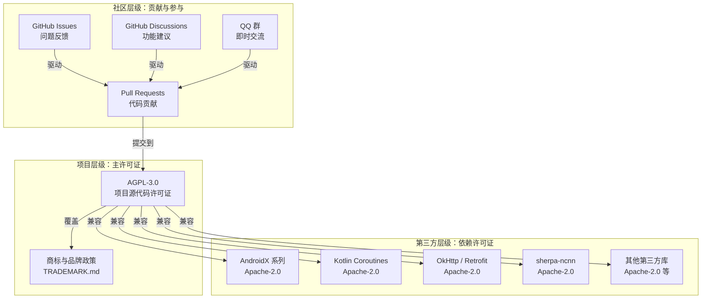
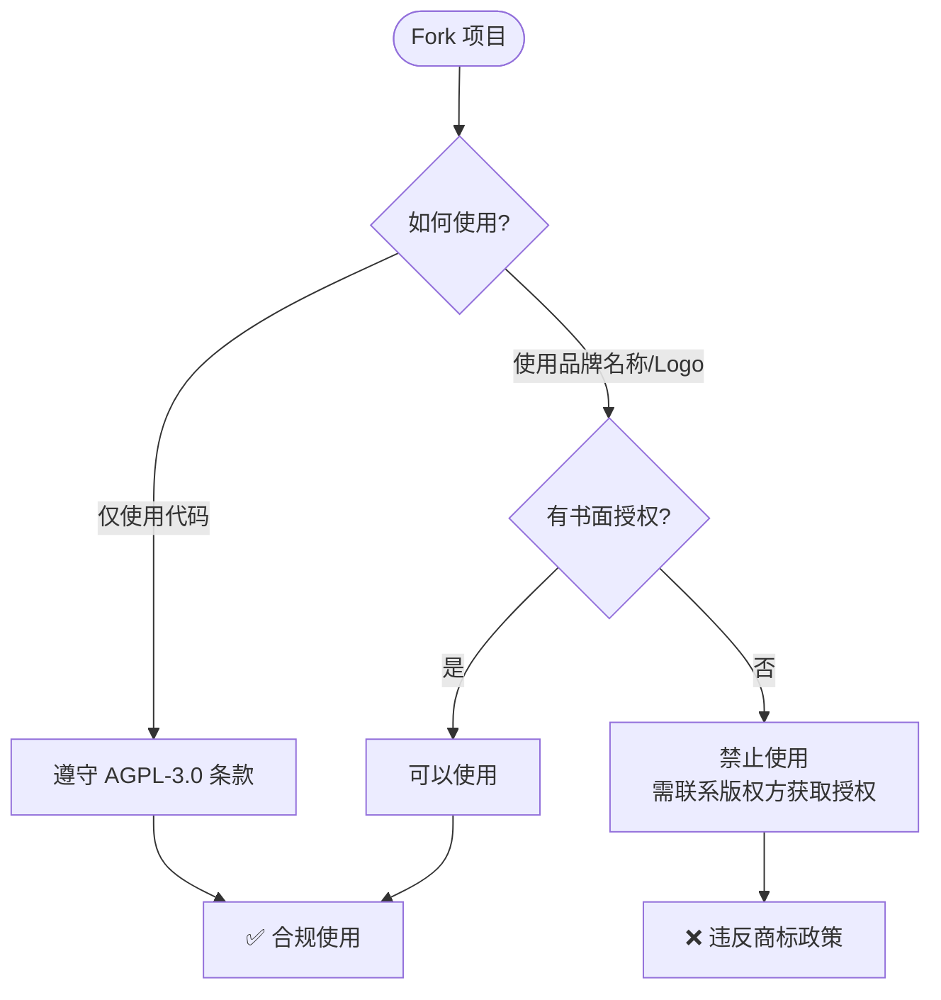
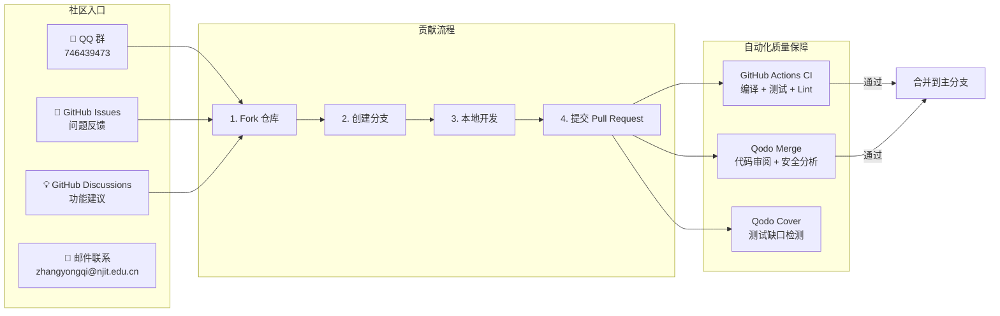
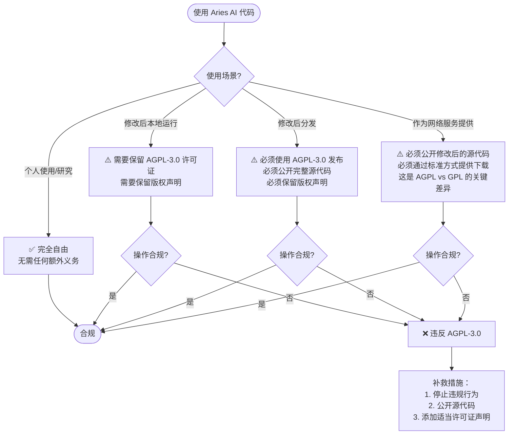

# 许可证与社区

Aries AI 采用 AGPL-3.0 协议开源，拥有活跃的开发者社区和完善的第三方组件许可体系。

## 概述

Aries AI 是一个完全开源的 Android AI 自动化引擎。项目代码以 [GNU Affero General Public License v3.0 (AGPL-3.0)](https://github.com/ZG0704666/Aries-AI/blob/main/LICENSE) 协议发布，确保软件自由的同时，要求所有修改后的版本以及作为网络服务提供时的源代码都必须向社区公开。项目同时提供多种社区参与渠道，包括 QQ 群、GitHub Issues/Discussions 和邮件联系，欢迎全球开发者参与贡献。

## 许可证架构

Aries AI 的许可证体系分为三个层级：**项目主许可证 (AGPL-3.0)**、**商标与品牌政策** 以及 **第三方依赖许可证**。



**架构说明：**

- **项目层级**：Aries AI 自己的源代码采用 AGPL-3.0 许可证，品牌资产（名称、Logo、图标等）由独立的商标政策保护，不属于开源许可证授权范围。
- **第三方层级**：所有第三方依赖库均使用与 AGPL-3.0 兼容的宽松许可证（主要为 Apache-2.0），确保项目的整体合规性。
- **社区层级**：多种社区渠道汇聚用户反馈和开发者贡献，最终通过 Pull Request 的形式回馈到项目源代码。

## AGPL-3.0 许可证

### 什么是 AGPL-3.0

AGPL-3.0（GNU Affero General Public License v3.0）是 GNU 通用公共许可证的一个变体，专门为网络服务器软件设计。与标准 GPL-3.0 不同，AGPL-3.0 增加了 **"网络服务条款"**（第 13 条）：如果修改后的程序在网络上提供服务，运营商必须公开该修改版本的源代码。

Aries AI 选择 AGPL-3.0 的核心原因在于：作为一个以 AI 自动化能力为核心的项目，AGPL-3.0 能确保无论代码以何种形式被使用（本地运行或服务化部署），下游用户始终能获取到完整的源代码，促进社区合作与技术透明。

> Source: [LICENSE](https://github.com/ZG0704666/Aries-AI/blob/main/LICENSE#L1-L7)

### 核心条款

| 条款 | 内容 | 影响 |
|------|------|------|
| **自由使用** | 可以自由使用、修改和分发代码 | ✅ 商业和非商业用途均允许 |
| **Copyleft 继承** | 修改后分发必须保持 AGPL-3.0 协议 | ⚠️ 衍生作品必须同样开源 |
| **网络服务条款** | 作为网络服务提供时必须公开源代码 | ⚠️ 这是与 GPL-3.0 的关键区别 |
| **专利授权** | 贡献者自动授予用户相关专利许可 | ✅ 保护用户免受专利诉讼 |
| **免责声明** | 软件按"原样"提供，无任何担保 | ⚠️ 使用者承担全部风险 |

### 源文件许可证声明

项目中的每个源文件头部均包含许可证声明，格式如下：

```kotlin
/*
 * Aries AI - Android UI Automation Framework
 * Copyright (C) 2025-2026 ZG0704666
 *
 * Licensed under AGPL-3.0. See LICENSE for details.
 *
 * Adapted from autoglm_KY-master InputHelper.kt
 */
package com.ai.phoneagent.input
```

> Source: [InputHelper.kt](https://github.com/ZG0704666/Aries-AI/blob/main/app/src/main/java/com/ai/phoneagent/input/InputHelper.kt#L1-L8)

这种在每个源文件中嵌入许可证声明的做法，确保即使单个文件被独立使用，其许可证条款也清晰可见，最大限度地保证 AGPL 的 copyleft 效果。

## 商标与品牌政策

Aries AI 的商标和品牌资产**不属于 AGPL-3.0 许可证授权的范围**。这些资产受到独立的商标政策保护。

> Source: [TRADEMARK.md](https://github.com/ZG0704666/Aries-AI/blob/main/TRADEMARK.md)

### 受保护的资产

以下内容**不**在 AGPL-3.0 许可证授权范围内：

| 资产类型 | 说明 |
|----------|------|
| 项目名称 | "Aries AI"（及任何可能引起混淆的相似名称） |
| Logo 和图标 | 项目使用的所有视觉标识 |
| 截图和宣传图 | 应用截图、宣传图片等品牌素材 |
| 官方标识 | 任何暗示与原始项目存在官方关系的标记 |

### 使用规则

**✅ 允许的操作：**
- 在遵守 AGPL-3.0 的前提下 Fork、修改和使用代码（包括商业用途）
- 使用代码功能实现自己的应用

**❌ 禁止的操作：**
- 使用原始项目名称/Logo/品牌标识暗示 Fork 版本是官方的或受认可的
- 使用相同或易混淆的名称/Logo/截图将 Fork 版本发布到应用商店
- 复用官方 Android applicationId：`io.github.zg0704666.ariesai`



## 第三方依赖许可证

Aries AI 依赖了多个优秀的开源项目。应用内通过 `LicensesScreen` 组件展示第三方组件的许可证信息。

> Source: [LicensesScreen.kt](https://github.com/ZG0704666/Aries-AI/blob/main/app/src/main/java/com/ai/phoneagent/ui/settings/LicensesScreen.kt#L38-L53)

### 第三方组件清单

| 组件名称 | 用途 | 许可证 |
|----------|------|--------|
| AndroidX Core KTX | Kotlin 扩展，简化 Android 核心库调用 | Apache-2.0 |
| AndroidX AppCompat | 向后兼容的 Android UI 组件 | Apache-2.0 |
| Material Components | Material Design 组件 | Apache-2.0 |
| AndroidX RecyclerView | 高效列表显示组件 | Apache-2.0 |
| AndroidX ConstraintLayout | 灵活的布局管理器 | Apache-2.0 |
| AndroidX Lifecycle | 生命周期感知组件 | Apache-2.0 |
| AndroidX Work | 后台任务调度 | Apache-2.0 |
| Kotlin Coroutines | 异步编程支持 | Apache-2.0 |
| OkHttp | HTTP 客户端 | Apache-2.0 |
| Retrofit | 类型安全的 HTTP 客户端 | Apache-2.0 |
| Gson | JSON 序列化/反序列化 | Apache-2.0 |
| multiplatform-markdown-renderer | Compose Markdown 渲染 | Apache-2.0 |
| sherpa-ncnn | 离线语音识别引擎 | Apache-2.0 |

### 许可证展示实现

`LicensesScreen` 使用 Jetpack Compose 的 `LazyColumn` 组件呈现第三方许可证列表，每条记录展示名称、描述和许可证类型：

```kotlin
private data class License(
    val name: String,
    val description: String,
    val license: String,
)

private val licenses =
    listOf(
        License("AndroidX Core KTX", "Kotlin extensions for Android core libraries", "Apache-2.0"),
        License("AndroidX AppCompat", "Backward-compatible Android UI components", "Apache-2.0"),
        License("Material Components", "Material Design components for Android", "Apache-2.0"),
        License("AndroidX RecyclerView", "Efficient list display widget", "Apache-2.0"),
        License("AndroidX ConstraintLayout", "Flexible layout manager", "Apache-2.0"),
        License("AndroidX Lifecycle", "Lifecycle-aware components", "Apache-2.0"),
        License("AndroidX Work", "Background task scheduling", "Apache-2.0"),
        License("Kotlin Coroutines", "Asynchronous programming support", "Apache-2.0"),
        License("OkHttp", "HTTP client for Android and Java", "Apache-2.0"),
        License("Retrofit", "Type-safe HTTP client", "Apache-2.0"),
        License("Gson", "JSON serialization/deserialization library", "Apache-2.0"),
        License("multiplatform-markdown-renderer", "Compose Markdown rendering", "Apache-2.0"),
        License("sherpa-ncnn", "Offline speech recognition engine", "Apache-2.0"),
    )
```

> Source: [LicensesScreen.kt](https://github.com/ZG0704666/Aries-AI/blob/main/app/src/main/java/com/ai/phoneagent/ui/settings/LicensesScreen.kt#L32-L53)

**设计意图**：所有第三方依赖均选用 Apache-2.0 或与 AGPL-3.0 兼容的许可证。Apache-2.0 是宽松型许可证，允许商业使用、修改和分发，与 AGPL-3.0 的 copyleft 条款兼容。这种选择确保了 Aries AI 在保持自身 AGPL-3.0 协议的同时，不会因依赖许可证冲突而面临法律风险。

## 社区



### 获取帮助

Aries AI 提供多种社区参与渠道，覆盖不同使用场景：

| 渠道 | 用途 | 链接 |
|------|------|------|
| **QQ 群** | 即时交流、安装帮助、使用讨论 | [746439473](http://qm.qq.com/cgi-bin/qm/qr?_wv=1027&k=&authKey=&noverify=0&group_code=746439473) |
| **GitHub Issues** | Bug 报告、问题追踪 | [GitHub Issues](https://github.com/ZG0704666/Aries-AI/issues) |
| **GitHub Discussions** | 功能建议、技术讨论 | [GitHub Discussions](https://github.com/ZG0704666/Aries-AI/discussions) |
| **邮件联系** | 正式沟通 | zhangyongqi@njit.edu.cn |

> Sources:
> - [README.md](https://github.com/ZG0704666/Aries-AI/blob/main/README.md#L274-L277)
> - [CONTRIBUTING.md](https://github.com/ZG0704666/Aries-AI/blob/main/CONTRIBUTING.md#L384-L386)

### 如何贡献

项目欢迎所有形式的贡献，包括 Bug 修复、新功能、文档改进、性能优化和测试用例。

**贡献流程：**

1. **Fork 项目**：在 GitHub 上创建你自己的仓库副本
2. **创建分支**：从 `develop` 分支创建功能分支，遵循命名规范
3. **本地开发**：完成代码编写后，运行编译验证、单元测试和 Lint 检查
4. **提交代码**：遵循约定式提交规范，格式为 `type(scope): description`
5. **推送分支**：`git push origin feature/your-feature-name`
6. **创建 Pull Request**：填写 PR 模板，清晰描述改动内容和测试方法

> Source: [CONTRIBUTING.md](https://github.com/ZG0704666/Aries-AI/blob/main/CONTRIBUTING.md#L56-L155)

### 分支命名规范

| 类型 | 前缀 | 示例 |
|------|------|------|
| 新功能 | `feature/` | `feature/virtual-screen-optimization` |
| Bug 修复 | `fix/` | `fix/screenshot-black-frame` |
| 文档改进 | `docs/` | `docs/update-api-guide` |
| 代码重构 | `refactor/` | `refactor/action-parser` |
| 性能优化 | `perf/` | `perf/reduce-screenshot-size` |
| 测试补充 | `test/` | `test/add-agent-configuration-tests` |

> Source: [CONTRIBUTING.md](https://github.com/ZG0704666/Aries-AI/blob/main/CONTRIBUTING.md#L73-L80)

### 提交信息规范

项目采用约定式提交（Conventional Commits）规范：

```
<type>(<scope>): <subject>

<body> (optional)

<footer> (optional)
```

常用 Type 类型：

| Type | 说明 |
|------|------|
| `feat` | 新功能 |
| `fix` | Bug 修复 |
| `docs` | 文档更新 |
| `style` | 代码格式（不影响功能） |
| `refactor` | 重构 |
| `perf` | 性能优化 |
| `test` | 测试相关 |
| `chore` | 构建/工具链 |

> Source: [CONTRIBUTING.md](https://github.com/ZG0704666/Aries-AI/blob/main/CONTRIBUTING.md#L106-L127)

### 自动化质量保障

每次 Pull Request 提交后，以下自动化流程将自动触发：

| 工作流 | 检查内容 |
|--------|----------|
| **GitHub Actions CI** | 编译、单元测试、Lint 检查 |
| **Qodo Merge** | 代码审阅、安全分析、性能建议 |
| **Qodo Cover** | 检测测试缺口、生成单元测试建议 |

> Source: [CONTRIBUTING.md](https://github.com/ZG0704666/Aries-AI/blob/main/CONTRIBUTING.md#L286-L292)

**设计意图**：通过多层自动化质量保障（CI 编译检查 + AI 代码审阅 + 测试覆盖检测），在 PR 合并前自动发现潜在问题。这降低了维护者的审查负担，也让外部贡献者能在提交后快速获得反馈，提升了社区协作效率。

### 开发者构建

```bash
# 克隆仓库
git clone https://github.com/ZG0704666/Aries-AI.git
cd Aries-AI

# 构建项目
./gradlew assembleDebug

# 安装到设备
adb install app/build/outputs/apk/debug/app-debug.apk
```

**环境要求**：JDK 17+、Android SDK 36、Gradle 8.13

> Source: [README.md](https://github.com/ZG0704666/Aries-AI/blob/main/README.md#L98-L110)

## 许可证合规流程图



## 配置选项

| 配置项 | 类型 | 默认值 | 说明 |
|--------|------|--------|------|
| 项目许可证 | string | `AGPL-3.0` | 在 [LICENSE](https://github.com/ZG0704666/Aries-AI/blob/main/LICENSE) 文件中定义 |
| 版权年份 | string | `2025-2026` | 各源文件头部声明中的版权年限 |
| 版权持有人 | string | `ZG0704666` | 项目作者的 GitHub 用户名 |
| 第三方许可证显示 | Composable | - | 通过 `LicensesScreen` 组件展示，定义于 [LicensesScreen.kt](https://github.com/ZG0704666/Aries-AI/blob/main/app/src/main/java/com/ai/phoneagent/ui/settings/LicensesScreen.kt) |
| 商标资产保护 | - | - | 定义于 [TRADEMARK.md](https://github.com/ZG0704666/Aries-AI/blob/main/TRADEMARK.md) |
| 官方 applicationId | string | `com.ai.phoneagent` | 定义于 [app/build.gradle.kts](https://github.com/ZG0704666/Aries-AI/blob/main/app/build.gradle.kts#L58) |

## 开源生态依赖

Aries AI 基于以下开源项目构建，向其致以诚挚感谢：

| 开源项目 | 用途 | 链接 |
|----------|------|------|
| Open-AutoGLM | 原始自动化框架参考 | [GitHub](https://github.com/THUDM/AutoGLM) |
| Sherpa-ncnn | 离线语音识别引擎 | [GitHub](https://github.com/k2-fsa/sherpa-ncnn) |
| Shizuku | 系统级权限管理 | [官网](https://shizuku.rikka.app) |

> Source: [Aries AI 开发文档.md](https://github.com/ZG0704666/Aries-AI/blob/main/Aries%20AI%20%E5%BC%80%E5%8F%91%E6%96%87%E6%A1%A3.md#L611-L613)

## API 参考

### `LicensesScreen(navController: NavController)`

应用内开源许可证展示页面的 Composable 入口函数。用户从"关于"页面导航进入后，展示所有第三方依赖及其许可证类型。

> Source: [LicensesScreen.kt](https://github.com/ZG0704666/Aries-AI/blob/main/app/src/main/java/com/ai/phoneagent/ui/settings/LicensesScreen.kt#L57)

**参数：**
- `navController` (NavController)：导航控制器，用于返回上一页面

**内部数据模型：**
```kotlin
private data class License(
    val name: String,        // 组件名称
    val description: String, // 组件描述
    val license: String,     // 许可证类型
)
```

> Source: [LicensesScreen.kt](https://github.com/ZG0704666/Aries-AI/blob/main/app/src/main/java/com/ai/phoneagent/ui/settings/LicensesScreen.kt#L32-L36)

**UI 结构：**
- `TopAppBar`：标题为"开源许可声明"，带返回按钮
- `LazyColumn`：以列表形式呈现每个第三方组件的名称、描述和许可证标签
- `Surface` 组件：许可证类型以胶囊标签样式显示

## 相关链接

### 项目核心文件
- [LICENSE（完整许可证文本）](https://github.com/ZG0704666/Aries-AI/blob/main/LICENSE)
- [README.md（项目主页）](https://github.com/ZG0704666/Aries-AI/blob/main/README.md)
- [CONTRIBUTING.md（贡献指南）](https://github.com/ZG0704666/Aries-AI/blob/main/CONTRIBUTING.md)
- [TRADEMARK.md（商标政策）](https://github.com/ZG0704666/Aries-AI/blob/main/TRADEMARK.md)

### 源码文件
- [LicensesScreen.kt（许可证展示页面）](https://github.com/ZG0704666/Aries-AI/blob/main/app/src/main/java/com/ai/phoneagent/ui/settings/LicensesScreen.kt)
- [InputHelper.kt（AGPL 许可证头示例）](https://github.com/ZG0704666/Aries-AI/blob/main/app/src/main/java/com/ai/phoneagent/input/InputHelper.kt)
- [app/build.gradle.kts（构建配置）](https://github.com/ZG0704666/Aries-AI/blob/main/app/build.gradle.kts)

### 社区资源
- [GitHub Issues（问题反馈）](https://github.com/ZG0704666/Aries-AI/issues)
- [GitHub Discussions（社区讨论）](https://github.com/ZG0704666/Aries-AI/discussions)
- [QQ 群：746439473](http://qm.qq.com/cgi-bin/qm/qr?_wv=1027&k=&authKey=&noverify=0&group_code=746439473)
- [GNU AGPL-3.0 官方页面](https://www.gnu.org/licenses/agpl-3.0.html)

### 相关开发文档
- [Aries AI 开发文档](https://github.com/ZG0704666/Aries-AI/blob/main/Aries%20AI%20%E5%BC%80%E5%8F%91%E6%96%87%E6%A1%A3.md)
- [构建指南](./BUILDING.md)
- [代码规范](./CODING_STANDARDS.md)
- [Git 工作流](./GIT_WORKFLOW.md)
