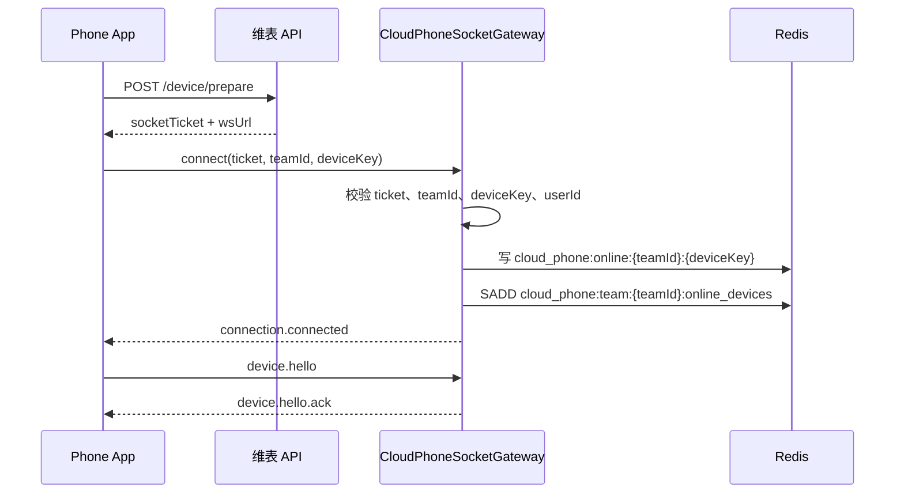
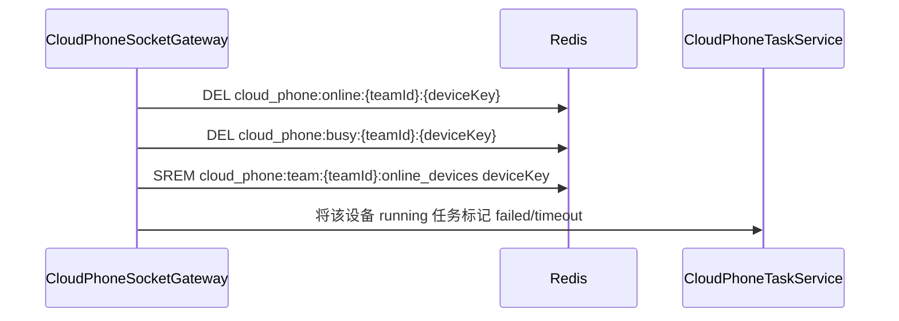
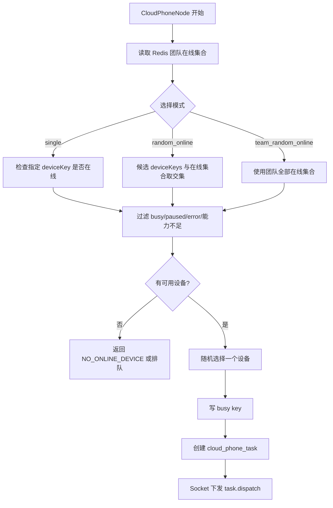

# 维表侧云手机处理方案

> 本文档只描述维表侧改造方案，不覆盖 `phone-AI` App 端实现细节。
>
> 核心边界：云手机能力在维表侧独立建设 `cloud-phone` 模块，使用独立 WebSocket、独立 Redis 在线注册、独立任务表、独立工作流节点；不改动、不复用、不影响 Yjs 协同 Socket 和其他现有 Socket。

## 1. 目标与边界

### 1.1 目标

1. 维表后端提供云手机专用 WebSocket 入口。
2. 手机 App 连接后，维表后端把在线设备注册到 Redis。
3. Socket 断开后，维表后端删除 Redis 在线设备数据；异常断开依赖 TTL 兜底过期。
4. 前端云手机管理页面直接读取 Redis 在线设备列表。
5. 工作流新增“云手机节点”，运行时从 Redis 在线设备中选择手机并下发任务。
6. 云手机节点支持两种设备选择方式：
   - 指定单个手机运行。
   - 从多个候选在线手机中随机选择一个运行。
7. 云手机任务真值落数据库，在线连接状态不落数据库。
8. 任务执行中断线后，不恢复旧任务；当前任务失败或超时，由维表工作流侧按重试策略重新发起新任务。

### 1.2 不做什么

| 不做项 | 说明 |
| --- | --- |
| 不改 Yjs 协同 | 不接入 Yjs update、awareness、sync，不调用协同广播 |
| 不复用其他 Socket | 不挂到通知、消息、协同、在线用户等已有 Socket |
| 不把在线设备写数据库 | 在线设备和连接会话只写 Redis |
| 不恢复未完成任务 | App 断线后旧任务终止，新任务由工作流重新发起 |
| 不做实时屏幕流 | 第一阶段只做任务投递、进度、结果，不做远程画面直播 |

## 2. 模块拆分

### 2.1 后端新增模块

建议新增独立目录：

```text
server/src/modules/cloud-phone/
├── controller/
│   ├── app-device.ts          # 设备准备、在线设备查询
│   ├── app-task.ts            # 任务查询、取消、日志查询
│   └── socket.ts              # 独立云手机 WebSocket 入口
├── entity/
│   ├── task.ts                # cloud_phone_task
│   └── task-event.ts          # cloud_phone_task_event
├── service/
│   ├── online-device-registry.ts  # Redis 在线设备注册表
│   ├── device-selector.ts         # 单设备/多候选/团队随机选择
│   ├── socket-ticket.ts           # 短期 socket ticket
│   ├── connection-registry.ts     # teamId + deviceKey 到连接路由
│   ├── task.ts                    # 任务创建、投递、等待结果
│   ├── result.ts                  # 任务事件与终态处理
│   └── scheduler.ts               # 超时、忙碌、重试、清理
├── protocol/
│   ├── envelope.ts            # Socket envelope
│   ├── types.ts               # 消息类型、任务状态、错误码
│   └── errors.ts              # 错误码映射
└── flow-node/
    └── cloud-phone.node.ts    # 工作流云手机节点
```

### 2.2 前端新增能力

| 位置 | 能力 |
| --- | --- |
| `web` 管理页面 | 云手机在线设备列表、状态刷新、设备筛选 |
| `ai-flow-web` 工作流画布 | 新增云手机节点组件和配置面板 |
| 工作流节点配置 | 支持单设备、多候选随机、团队随机在线选择 |
| 工作流调试面板 | 展示任务状态、目标设备、失败原因、结果摘要 |

前端只通过后端接口读取 Redis 结果，不直接连接 Redis。

## 3. Redis 在线注册设计

### 3.1 Redis Key

#### 单设备在线 Key

```text
cloud_phone:online:{teamId}:{deviceKey}
```

Value：

```json
{
  "teamId": "team_1",
  "deviceKey": "sha256-device-a",
  "deviceCode": "team_1:sha256-device-a",
  "deviceName": "Pixel 8 Pro",
  "userId": "user_1",
  "connectionId": "conn_01H...",
  "gatewayId": "gateway_1",
  "status": "online",
  "busy": false,
  "platform": "android",
  "appVersion": "v1.4.2-xyla.alpha",
  "capabilities": {
    "virtualDisplay": true,
    "shizuku": true,
    "accessibility": true,
    "screenshot": true,
    "uiTree": true,
    "maxConcurrentTasks": 1
  },
  "connectedAt": 1760000000000,
  "lastHeartbeatAt": 1760000010000
}
```

#### 团队在线集合

```text
cloud_phone:team:{teamId}:online_devices
```

类型：Set  
成员：`deviceKey`

#### 设备忙碌 Key

```text
cloud_phone:busy:{teamId}:{deviceKey}
```

Value：

```json
{
  "taskId": "cpt_01H...",
  "flowRunId": "flow_run_01H...",
  "startedAt": 1760000000000,
  "timeoutAt": 1760000300000
}
```

### 3.2 生命周期

| 时机 | 操作 |
| --- | --- |
| Socket 鉴权成功 | `SET cloud_phone:online:{teamId}:{deviceKey}`，`SADD cloud_phone:team:{teamId}:online_devices` |
| 心跳 | 更新在线 key 的 `lastHeartbeatAt/status/capabilities` 并刷新 TTL |
| 任务开始 | `SET cloud_phone:busy:{teamId}:{deviceKey}` |
| 任务完成/失败/取消/超时 | 删除 busy key |
| Socket 正常断开 | 删除 online key、busy key，并 `SREM` 团队在线集合 |
| Socket 异常断开 | close/error 尝试删除；失败时依赖 TTL 自动过期 |
| 前端管理页查询 | 读取团队在线集合，再批量读取 online key |
| 云手机节点选设备 | 读取团队在线集合，过滤 busy 和能力后选择 |

TTL 建议：

| Key | TTL |
| --- | --- |
| online key | 心跳周期的 3 到 4 倍，例如 90 到 120 秒 |
| busy key | 任务超时时间 + 30 秒 |
| socket ticket | 30 到 120 秒 |

## 4. 后端接口设计

### 4.1 设备准备接口

App 登录后调用，用于申请短期 Socket ticket。

```http
POST /app/cloud-phone/device/prepare
Authorization: Bearer <accessToken>
Content-Type: application/json
```

请求：

```json
{
  "teamId": "team_1",
  "deviceKey": "sha256-device-a",
  "deviceName": "Pixel 8 Pro",
  "platform": "android",
  "appVersion": "v1.4.2-xyla.alpha",
  "capabilities": {
    "virtualDisplay": true,
    "shizuku": true,
    "accessibility": true,
    "screenshot": true,
    "uiTree": true,
    "maxConcurrentTasks": 1
  }
}
```

返回：

```json
{
  "teamId": "team_1",
  "deviceKey": "sha256-device-a",
  "deviceCode": "team_1:sha256-device-a",
  "wsUrl": "wss://api.example.com/app/cloud-phone/ws",
  "socketTicket": "one-time-ticket",
  "ticketExpiresAt": 1760000000000
}
```

校验：

1. 当前用户必须属于 `teamId`。
2. `deviceKey` 必须是合法长度和格式。
3. `socketTicket` 只能绑定当前 `teamId + deviceKey + userId`。
4. ticket 短期有效，一次使用或短时间内有限次使用。

### 4.2 在线设备列表接口

前端管理页调用。后端读取 Redis 后返回。

```http
GET /app/cloud-phone/:teamId/devices/online
```

返回：

```json
{
  "items": [
    {
      "teamId": "team_1",
      "deviceKey": "sha256-device-a",
      "deviceCode": "team_1:sha256-device-a",
      "deviceName": "Pixel 8 Pro",
      "status": "online",
      "busy": false,
      "platform": "android",
      "appVersion": "v1.4.2-xyla.alpha",
      "capabilities": {
        "virtualDisplay": true,
        "screenshot": true,
        "uiTree": true
      },
      "lastHeartbeatAt": 1760000010000
    }
  ]
}
```

### 4.3 任务查询接口

```http
GET /app/cloud-phone/:teamId/tasks/:taskId
```

用途：

1. 工作流调试面板查看任务结果。
2. 前端管理页查看任务状态。
3. 排查失败原因和设备选择结果。

### 4.4 任务取消接口

```http
POST /app/cloud-phone/:teamId/tasks/:taskId/cancel
```

处理：

1. 校验任务归属 `teamId`。
2. 若任务还未投递，直接标记 `cancelled`。
3. 若任务已投递且设备在线，通过独立 Socket 发送 `task.cancel`。
4. 若设备已断开，任务标记 `failed` 或 `cancelled`，不等待 App 恢复。

## 5. 独立 WebSocket 设计

### 5.1 连接入口

```text
wss://<server-host>/app/cloud-phone/ws?ticket=<socketTicket>&teamId=<teamId>&deviceKey=<deviceKey>&protocolVersion=1
```

硬约束：

| 约束 | 说明 |
| --- | --- |
| 独立路径 | 不挂载到 Yjs、通知、消息、在线用户 Socket |
| 独立 Gateway | 使用 `CloudPhoneSocketGateway` |
| 独立协议 | 使用云手机任务协议，不复用协同协议 |
| 独立 Redis key | 只写 `cloud_phone:*` |
| 独立限流 | 按 `teamId/deviceKey/taskId` 限流，不共享协同限流 |

### 5.2 连接建立流程



### 5.3 断开处理



断线不恢复旧任务。App 重连后只是重新注册在线状态，等待新的 `task.dispatch`。

## 6. 工作流云手机节点

### 6.1 节点定位

新增后端节点：`CloudPhoneNode`。  
该节点继承现有工作流 `FlowNode` 模型，由 `FlowExecutor` 调用。

节点职责：

1. 读取节点配置和上游变量。
2. 渲染手机任务指令。
3. 调用 `CloudPhoneDeviceSelector` 从 Redis 选择设备。
4. 创建 `cloud_phone_task`。
5. 通过 `CloudPhoneSocketGateway` 下发 `task.dispatch`。
6. 等待任务终态或超时。
7. 将结果写回工作流上下文。

### 6.2 节点配置

```json
{
  "type": "cloud_phone",
  "deviceSelector": {
    "mode": "random_online",
    "deviceKeys": [
      "sha256-device-a",
      "sha256-device-b"
    ],
    "requiredCapabilities": ["virtualDisplay", "screenshot", "uiTree"],
    "onNoDevice": "fail"
  },
  "instructionTemplate": "打开 {{appName}}，完成 {{actionText}}",
  "execution": {
    "timeoutMs": 300000,
    "maxSteps": 50,
    "sensitivePolicy": "block"
  },
  "retryPolicy": {
    "maxAttempts": 1,
    "retryOn": ["DEVICE_DISCONNECTED", "NO_ONLINE_DEVICE"]
  }
}
```

### 6.3 设备选择模式

| 模式 | 说明 |
| --- | --- |
| `single` | 只选择一个指定 `deviceKey` |
| `random_online` | 从配置的 `deviceKeys[]` 中随机选择在线且非忙碌设备 |
| `team_random_online` | 从团队所有在线设备中随机选择在线且非忙碌设备 |

选择流程：



### 6.4 断线处理

任务执行期间如果 Socket 断开：

1. Redis 删除 online key 和 busy key。
2. `cloud_phone_task` 标记 `failed` 或 `timeout`。
3. 错误码写 `DEVICE_DISCONNECTED`。
4. `CloudPhoneNode` 返回失败。
5. 如果配置了 `retryPolicy`，工作流重新创建新任务并重新选择设备。
6. App 重连后只接收新任务，不恢复旧任务。

## 7. 数据库表设计

在线设备不落库，只保留任务与任务事件。

### 7.1 `cloud_phone_task`

| 字段 | 类型 | 说明 |
| --- | --- | --- |
| `id` | varchar | 任务 ID |
| `teamId` | varchar | 团队隔离 |
| `projectId` | varchar | 项目隔离 |
| `flowId` | int | 工作流 ID |
| `flowRunId` | varchar | 工作流运行 ID |
| `nodeId` | varchar | 节点 ID |
| `deviceKey` | varchar | 目标设备唯一编码 |
| `deviceCode` | varchar | `teamId + deviceKey` |
| `operatorUserId` | varchar | 触发用户 |
| `status` | varchar | `created/dispatching/accepted/running/completed/failed/cancelled/timeout` |
| `instruction` | text | 渲染后的任务指令 |
| `config` | json | 节点执行配置 |
| `input` | json | 输入变量 |
| `output` | json | 输出结果 |
| `errorCode` | varchar | 错误码 |
| `errorMessage` | text | 错误信息 |
| `idempotencyKey` | varchar | 幂等键 |
| `createdAt` | datetime | 创建时间 |
| `startedAt` | datetime | 开始时间 |
| `finishedAt` | datetime | 结束时间 |

索引：

| 索引 | 说明 |
| --- | --- |
| `(teamId, projectId, flowRunId)` | 按工作流运行查询 |
| `(teamId, deviceKey, status)` | 查询设备任务状态 |
| `idempotencyKey unique` | 防止同一 attempt 重复创建 |

### 7.2 `cloud_phone_task_event`

| 字段 | 类型 | 说明 |
| --- | --- | --- |
| `id` | bigint | 自增 ID |
| `taskId` | varchar | 任务 ID |
| `eventSeq` | int | App 侧事件序号 |
| `type` | varchar | 事件类型 |
| `messageId` | varchar | Socket 消息 ID |
| `payload` | json | 事件内容 |
| `createdAt` | datetime | 创建时间 |

索引：

| 索引 | 说明 |
| --- | --- |
| `(taskId, eventSeq) unique` | 防重复事件 |
| `(taskId, createdAt)` | 查询任务日志 |

## 8. 前端处理方案

### 8.1 云手机管理页

页面能力：

| 功能 | 数据来源 |
| --- | --- |
| 查看团队在线云手机 | `GET /app/cloud-phone/:teamId/devices/online` |
| 查看设备能力 | Redis online key |
| 查看忙碌状态 | Redis busy key |
| 查看最近任务 | `cloud_phone_task` 查询接口 |
| 手动刷新 | 重新请求在线设备接口 |

不建议第一阶段做“设备管理数据库”。设备是否在线以 Redis 为准。

### 8.2 工作流节点配置面板

配置项：

| 配置 | 说明 |
| --- | --- |
| 选择模式 | 单设备 / 多候选随机 / 团队随机 |
| 候选设备 | 从在线设备接口拉取，保存 `deviceKey` 列表到节点配置 |
| 指令模板 | 支持引用上游变量 |
| 超时时间 | 默认 5 分钟 |
| 最大步骤数 | 传给 App 执行 |
| 无设备策略 | 失败 / 排队 |
| 重试策略 | 断线、无设备、设备忙时是否重新发起新任务 |

节点配置保存到工作流 `data/draft`，不保存在线设备详情，只保存 `deviceKey` 或选择策略。

### 8.3 工作流运行展示

运行时展示：

1. 选择到的 `deviceName/deviceKey`。
2. 任务状态。
3. 执行进度。
4. 失败错误码。
5. 最终输出。
6. 关键截图或日志 artifact。

## 9. 权限与隔离

### 9.1 权限校验

| 场景 | 校验 |
| --- | --- |
| 设备准备 | 用户必须属于 `teamId` |
| Socket 连接 | ticket 必须匹配 `teamId + deviceKey + userId` |
| 在线设备查询 | 用户必须有团队访问权限 |
| 云手机节点运行 | 工作流、项目、团队权限必须全部通过 |
| 设备选择 | 只能选择当前 `teamId` Redis 在线集合内设备 |
| 任务查询 | 只能查询当前团队和项目范围内任务 |

### 9.2 审计要求

每个任务必须记录：

1. `teamId`
2. `projectId`
3. `flowId`
4. `flowRunId`
5. `nodeId`
6. `operatorUserId`
7. `deviceKey/deviceCode`
8. 渲染后的任务指令
9. 执行结果或错误码

## 10. 上线步骤

### 10.1 第一阶段 MVP

| 步骤 | 内容 | 验证 |
| --- | --- | --- |
| 1 | 新增 `cloud-phone` 后端模块 | 模块可独立启动，不影响现有服务 |
| 2 | 接入 Redis 在线注册 | Socket 连接写 Redis，断开删除 Redis |
| 3 | 新增在线设备接口 | 前端能看到团队在线设备 |
| 4 | 新增任务表和事件表 | 任务创建、事件追加、终态更新正常 |
| 5 | 新增独立 WebSocket | 不影响 Yjs 和其他 Socket |
| 6 | 新增 `CloudPhoneNode` | 工作流能创建任务并等待结果 |
| 7 | 新增节点配置面板 | 可选择单设备或多候选随机 |
| 8 | 打通短任务链路 | 任务下发、执行、回传完成 |

### 10.2 第二阶段稳定性

| 能力 | 说明 |
| --- | --- |
| Redis TTL 兜底清理 | 防止异常断开残留在线设备 |
| busy key 保护 | 防止同一手机并发执行多个任务 |
| ACK 和消息去重 | 防止重复投递和重复事件 |
| 任务超时处理 | 超时标记失败并删除 busy |
| 重试策略 | 工作流侧重新创建新任务 |
| 监控告警 | Socket 在线数、任务失败率、Redis 残留 |

### 10.3 第三阶段增强

| 能力 | 说明 |
| --- | --- |
| 设备分组 | 支持用户配置候选设备组 |
| 任务队列 | 没有空闲设备时排队 |
| 管理后台 | 任务日志、设备在线历史、失败统计 |
| 多网关路由 | 多实例 Socket 通过 Redis 路由投递 |
| 灰度开关 | 按团队开启云手机能力 |

## 11. 验证清单

### 11.1 Redis 验证

| 用例 | 预期 |
| --- | --- |
| App 连接成功 | Redis 写入 online key 和团队 Set |
| App 正常断开 | Redis 删除 online key、busy key 和团队 Set 成员 |
| App 异常断开 | close/error 尝试删除，TTL 到期后自动消失 |
| 心跳正常 | online key TTL 被持续刷新 |
| 任务开始 | busy key 写入 |
| 任务结束 | busy key 删除 |

### 11.2 设备选择验证

| 用例 | 预期 |
| --- | --- |
| 单设备在线 | 选择该设备 |
| 单设备离线 | 返回 `NO_ONLINE_DEVICE` 或排队 |
| 多候选部分在线 | 只从在线候选中随机选择 |
| 多候选全离线 | 返回 `NO_ONLINE_DEVICE` |
| 团队随机 | 从团队在线集合中过滤 busy 后随机选择 |
| 设备 busy | 不被随机选中 |

### 11.3 Socket 隔离验证

| 用例 | 预期 |
| --- | --- |
| 云手机 Socket 关闭 | Yjs 协同不受影响 |
| Yjs 协同关闭 | 云手机 Socket 不受影响 |
| 云手机高频日志 | 不触发协同广播和协同限流 |
| 云手机连接 | 不写协同在线用户表 |

### 11.4 工作流验证

| 用例 | 预期 |
| --- | --- |
| 云手机节点运行成功 | 工作流拿到 `completed` 输出 |
| App 执行中断线 | 当前任务 `failed/timeout`，不续跑 |
| 节点配置重试 | 创建新 `taskId` 重新下发 |
| 无在线设备 | 节点失败或排队，按配置处理 |

## 12. 风险与处理

| 风险 | 说明 | 处理 |
| --- | --- | --- |
| Redis 残留在线设备 | 异常断开未执行删除 | TTL 兜底 + 心跳刷新 + 定时扫描 |
| 多实例投递失败 | 设备连接在其他网关实例 | Redis 记录 `gatewayId/connectionId`，后续接入网关间投递 |
| 设备随机不均衡 | 简单随机可能集中到少数设备 | 第二阶段加入权重、最近使用时间、失败率 |
| 任务重复投递 | 网络重试导致重复消息 | `messageId` ACK 去重 + `idempotencyKey` |
| 断线误恢复 | App 重连后继续旧任务会有安全风险 | 协议禁止恢复旧任务，断线即终态失败 |
| 影响协同 Socket | 误复用协同连接或广播 | 代码评审禁止依赖 Yjs/协同 gateway |

## 13. 一句话结论

维表侧只需要把云手机作为独立实时任务通道处理：Socket 连接后按 `teamId + deviceKey` 写 Redis，断开后删除 Redis；前端管理页和 `CloudPhoneNode` 都从 Redis 读取在线设备；工作流节点可指定单个手机，也可从多个在线候选中随机选择；任务结果和审计落数据库；断线不恢复旧任务，而是由维表工作流重新发起新任务。
