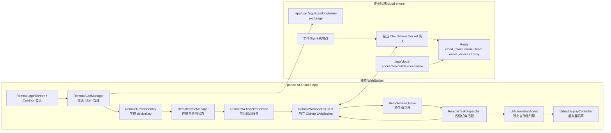
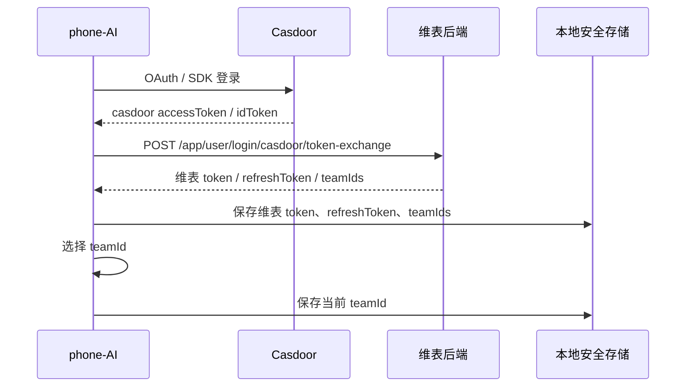
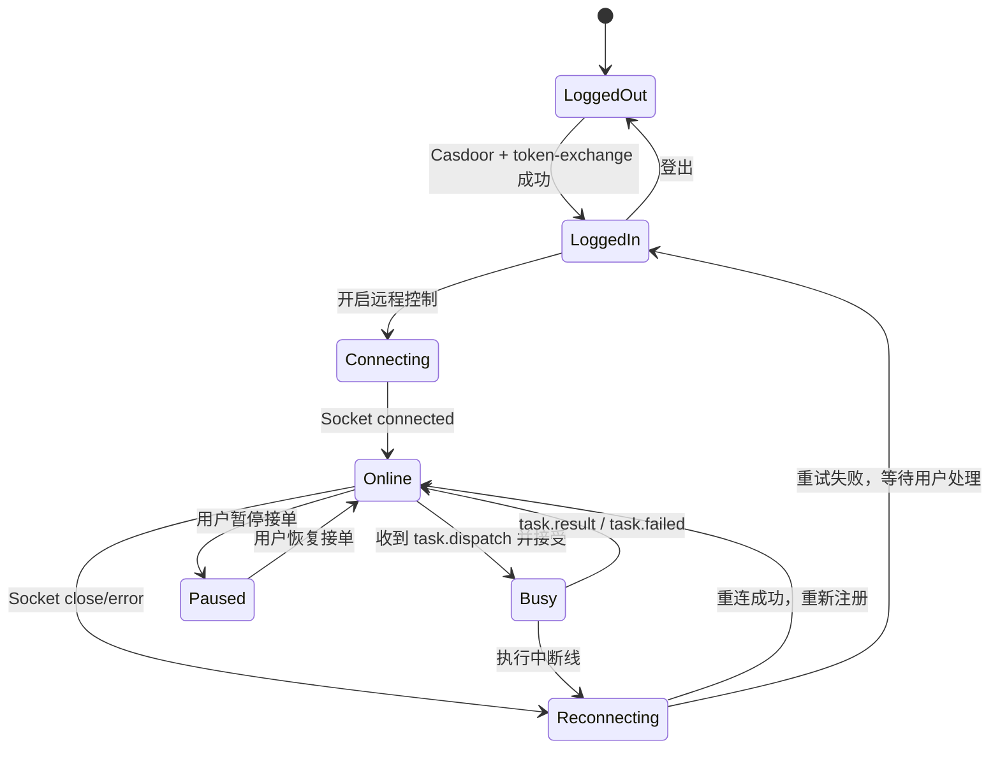

# 7-2 phone-AI 端改造方案

> 本文档用于承接 `7-1维表处理方案.md` 和 `7.结合维表的架构设计.md` 中已经落到维表侧的云手机能力，聚焦 `phone-AI` / Aries AI Android App 侧改造。
>
> 核心口径：维表侧已经按独立云手机模块处理在线设备、Redis 注册、前端云手机管理入口和工作流云手机节点的服务边界；`phone-AI` 端只负责登录维表、建立独立云手机连接、注册设备、接收新任务、执行自动化任务并回传结果。云手机连接不能接入、复用或影响维表 Yjs 协同 Socket。

## 1. 参考文档与当前结论

| 文档 | 对本方案的约束 |
| --- | --- |
| `6.远程控制模式改造设计文档.md` | `phone-AI` 侧新增远程控制模式，新增代码集中放在 `com.ai.phoneagent.remote`，尽量少改现有 Kotlin 文件 |
| `7-1维表处理方案.md` | 维表侧云手机能力独立为 `cloud-phone` 模块，在线设备只进入 Redis，断线后不恢复旧任务 |
| `7.结合维表的架构设计.md` | 云手机 Socket 是任务控制通道，不是协同通道；需要登录、设备在线、任务下发、任务回执和断线机制 |
| `.trae/已开发文档/统一认证登录机制.md` | App 端先拿 Casdoor token，再调用维表 `POST /app/user/login/casdoor/token-exchange` 换维表本地 token |
| `.trae/已开发文档/yjs-socket 协作指南.md` | Yjs 协同 Socket 只负责表格协同，不允许云手机连接复用或污染该链路 |

当前可按以下前提推进：

1. `phone-AI` 端登录主线使用 Casdoor 登录，再换维表 JWT。
2. 后续维表业务接口和云手机 Socket 鉴权只使用维表本地 token，不直接使用 Casdoor token。
3. 在线设备状态以 Redis 为准，Redis key 使用 `teamId + deviceKey`。
4. `phone-AI` 断线重连只重新注册在线态，不续跑旧任务。
5. 维表工作流侧会在任务失败、断线或重试时重新发起新任务，App 只接收新的 `task.dispatch`。

## 2. 改造目标与边界

### 2.1 改造目标

| 目标 | 说明 |
| --- | --- |
| 支持登录维表 | App 启动后支持 Casdoor 登录，并通过维表 token-exchange 获取维表 token |
| 支持团队选择 | 登录后从维表 token 返回的团队或团队接口中选择当前 `teamId` |
| 支持设备唯一身份 | 本地生成稳定 `deviceKey`，后续 Redis 注册和任务路由都用 `teamId + deviceKey` |
| 支持独立 WebSocket | App 使用独立云手机 Socket 客户端连接维表云手机网关，不连接 Yjs |
| 支持在线注册 | Socket 连接成功后维表侧写入 Redis，管理页可看到在线设备 |
| 支持任务执行 | App 接收维表工作流下发的任务，调用现有 `UiAutomationAgent` 执行 |
| 支持状态回传 | 回传 accepted、started、progress、result、failed、cancelled 等任务状态 |
| 支持断线策略 | 断线即终止当前远程任务或标记失败；重连后只等待新任务 |
| 保留离线能力 | 未登录或断开云端时，本地原有对话、自动化能力继续可用 |

### 2.2 不做什么

| 不做项 | 说明 |
| --- | --- |
| 不改维表 Yjs 协同 | App 端不连接 `/mul/yjs/shared`，也不实现任何 Yjs 协议 |
| 不复用其他 Socket | 云手机连接单独封装为 `RemoteWebSocketClient`，不复用聊天、更新、通知等连接 |
| 不把在线设备落本地数据库当真值 | App 可缓存设备配置，但在线与忙碌状态以维表 Redis 为准 |
| 不恢复旧任务 | Socket 断开后，App 不在本地恢复未完成远程任务 |
| 不新增复杂设备管理 | 第一阶段不做设备分组、设备授权审批、历史在线轨迹 |
| 不重构自动化主循环 | 远程任务通过适配器调用现有 `UiAutomationAgent`，不重写 Agent |

## 3. 总体架构



设计重点：

1. `RemoteWebSocketClient` 是 App 内独立客户端，只连接云手机网关。
2. `RemoteTaskDispatcher` 不直接做自动化动作，只把云端任务转换成现有 `UiAutomationAgent` 能执行的本地任务。
3. `RemoteTaskQueue` 控制远程任务并发，第一阶段按单设备单任务处理。
4. `RemoteStateManager` 统一管理登录态、当前团队、连接状态、暂停接单状态、当前任务状态。
5. 所有云手机远程能力集中在 `com.ai.phoneagent.remote` 包，避免污染现有主聊天和自动化代码。

## 4. phone-AI 新增模块规划

建议新增目录：

```text
app/src/main/java/com/ai/phoneagent/remote/
├── RemoteConstants.kt
├── RemoteConfig.kt
├── RemoteProtocol.kt
├── RemoteAuthManager.kt
├── RemoteDeviceIdentity.kt
├── RemoteStateManager.kt
├── RemoteWebSocketService.kt
├── RemoteWebSocketClient.kt
├── RemoteTaskQueue.kt
├── RemoteTaskDispatcher.kt
├── RemoteTaskReporter.kt
├── RemoteCapabilityCollector.kt
├── data/
│   ├── RemoteSessionStore.kt
│   └── RemotePreferencesRepository.kt
├── di/
│   └── RemoteModule.kt
└── ui/
    ├── RemoteLoginScreen.kt
    ├── RemoteTeamSelectScreen.kt
    └── RemoteControlScreen.kt
```

模块职责：

| 模块 | 职责 | 主要依赖 |
| --- | --- | --- |
| `RemoteConstants` | 统一维护维表 baseUrl、Socket path、心跳周期、协议版本 | 无 |
| `RemoteConfig` | 支持 debug/prod 环境配置、连接地址切换 | `BuildConfig`、DataStore |
| `RemoteProtocol` | 定义 Socket envelope、消息类型、任务 payload、错误码 | `kotlinx.serialization` |
| `RemoteAuthManager` | Casdoor 登录、维表 token-exchange、刷新 token、登出 | `OkHttpClient`、DataStore |
| `RemoteDeviceIdentity` | 生成并持久化 `installId/deviceKey/deviceName` | Android Settings、DataStore |
| `RemoteStateManager` | 维护登录态、团队、连接态、暂停接单和当前任务 | Kotlin Flow / StateFlow |
| `RemoteWebSocketService` | 前台 Service，负责启动和保活云手机连接 | Android Service、通知 |
| `RemoteWebSocketClient` | 独立 OkHttp WebSocket，负责连接、心跳、重连、收发消息 | `OkHttpClient` |
| `RemoteTaskQueue` | 远程任务排队、互斥、幂等、取消 | Coroutine、Mutex |
| `RemoteTaskDispatcher` | 将云端任务转为 `UiAutomationAgent` 调用 | `UiAutomationAgent`、`AgentConfiguration` |
| `RemoteTaskReporter` | 统一上报任务 accepted/progress/result/failed | `RemoteWebSocketClient` |
| `RemoteCapabilityCollector` | 收集虚拟屏、Shizuku、无障碍、截图、UI 树能力 | `ShizukuBridge`、系统权限 |
| `RemoteSessionStore` | 本地保存 token、teamId、deviceKey、连接配置 | DataStore / EncryptedSharedPreferences |
| `RemoteModule` | Koin 注入模块，按单例/工厂注册远程能力 | Koin |
| `RemoteLoginScreen` | 登录门禁页，支持登录和离线使用 | Compose |
| `RemoteTeamSelectScreen` | 多团队选择页 | Compose |
| `RemoteControlScreen` | 云端连接状态、接单开关、当前任务展示 | Compose |

### 4.1 需要少量改动的现有文件

| 文件 | 改动 | 原则 |
| --- | --- | --- |
| `AriesAgentApp.kt` | `startKoin` 增加 `remoteModule` | 只注册模块，不改现有 binding |
| `Routes.kt` | 增加远程登录、团队选择、远程控制路由 | 只加路由常量 |
| `AriesNavGraph.kt` | 增加远程页面 route，启动页按登录态判断 | 保留离线进入 Home 的能力 |
| `AndroidManifest.xml` | 声明 `RemoteWebSocketService` 和 OAuth redirect activity/filter | 不改现有 service |
| 设置页或侧边栏入口 | 增加“云端连接/远程控制”入口 | 不影响原有主对话入口 |

## 5. 登录与本地会话设计

### 5.1 登录主流程



维表 token-exchange 请求：

```http
POST /app/user/login/casdoor/token-exchange
Content-Type: application/json
```

```json
{
  "accessToken": "casdoor_access_token",
  "idToken": "casdoor_id_token_optional",
  "tokenType": "access_token",
  "platform": "android",
  "deviceId": "deviceKey",
  "clientType": "phone_ai"
}
```

成功后保存：

| 字段 | 保存位置 | 说明 |
| --- | --- | --- |
| `cloudBaseUrl` | DataStore，可配置 | 维表 API 地址 |
| `dimensToken` | Android Keystore / EncryptedSharedPreferences 优先 | 维表业务 token |
| `dimensRefreshToken` | Android Keystore / EncryptedSharedPreferences 优先 | 维表 refreshToken |
| `teamIds` | DataStore | 当前账号可用团队 |
| `currentTeamId` | DataStore | 当前云手机注册团队 |
| `deviceKey` | DataStore | 设备唯一信息编码 |
| `deviceName` | DataStore | 管理页展示名称 |
| `remoteEnabled` | DataStore | 是否开启远程接单 |
| `acceptTasks` | DataStore | 是否暂停接收云端任务 |

### 5.2 离线使用

登录页保留“离线使用”入口：

1. 离线模式不启动 `RemoteWebSocketService`。
2. 离线模式不向 Redis 注册在线设备。
3. 离线模式不影响现有主对话、自动化、设置、权限引导能力。
4. 用户后续可以从设置或远程控制页重新登录并开启云端连接。

### 5.3 token 刷新

`RemoteAuthManager` 需要提供：

```kotlin
interface RemoteAuthManager {
    suspend fun loginWithCasdoor(): RemoteLoginResult
    suspend fun exchangeCasdoorToken(casdoorToken: CasdoorToken): DimensSession
    suspend fun refreshDimensToken(): DimensSession?
    suspend fun currentSession(): DimensSession?
    suspend fun logout()
}
```

刷新策略：

| 场景 | 处理 |
| --- | --- |
| HTTP 返回 401 | 尝试使用 `dimensRefreshToken` 刷新 |
| Socket 连接返回 `AUTH_EXPIRED` | 刷新维表 token 后重连 |
| refresh 失败 | 停止云手机连接，清理本地 token，回到登录页 |
| 用户登出 | 关闭 Socket，删除本地 token，通知维表侧断开后清 Redis |

## 6. 设备身份设计

### 6.1 字段定义

| 字段 | 生成方 | 用途 |
| --- | --- | --- |
| `installId` | App 首次启动生成 UUID | 本地安装实例标识 |
| `androidId` | 系统提供 | 辅助生成稳定设备指纹 |
| `packageName` | App | 防止不同包名冲突 |
| `deviceKey` | App hash 生成 | 维表 Redis 注册和任务路由主键 |
| `deviceCode` | App/服务端约定 | `${teamId}:${deviceKey}` |
| `deviceName` | App 默认生成，可用户修改 | 管理页展示名称 |

推荐 `deviceKey`：

```text
deviceKey = sha256(androidId + ":" + installId + ":" + packageName)
```

说明：

1. `deviceKey` 不使用手机号、账号、真实序列号等敏感明文。
2. `installId` 第一次启动生成后持久化，卸载重装后允许变化。
3. 同一台设备切换团队时 `deviceKey` 不变，但 Redis key 因 `teamId` 不同而隔离。
4. 日志中允许打印截断后的 `deviceKey`，不打印 token。

### 6.2 设备能力上报

`RemoteCapabilityCollector` 每次连接和心跳时上报能力：

```json
{
  "platform": "android",
  "appVersion": "v1.4.3",
  "capabilities": {
    "virtualDisplay": true,
    "shizuku": true,
    "accessibility": true,
    "screenshot": true,
    "uiTree": true,
    "maxConcurrentTasks": 1
  },
  "permissions": {
    "accessibility": true,
    "shizuku": true,
    "overlay": true,
    "notification": true
  }
}
```

维表工作流选择设备时会按这些能力过滤在线设备。

## 7. 独立 WebSocket 连接设计

### 7.1 连接入口

App 端只连接维表云手机专用入口。推荐形式：

```text
wss://dimens.example.com/cloud-phone/socket?teamId={teamId}&deviceKey={deviceKey}&token={dimensToken}
```

如果维表后端提供 socket ticket，则改为：

```text
wss://dimens.example.com/app/cloud-phone/ws?ticket={socketTicket}&teamId={teamId}&deviceKey={deviceKey}&protocolVersion=1
```

App 侧需要把路径做成配置项，不能写死在业务代码中：

| 配置项 | 示例 |
| --- | --- |
| `cloudBaseUrl` | `https://dimens.example.com` |
| `cloudSocketUrl` | `wss://dimens.example.com/cloud-phone/socket` |
| `protocolVersion` | `1` |
| `heartbeatIntervalMs` | `25000` |

### 7.2 连接参数

| 参数 | 必填 | 说明 |
| --- | --- | --- |
| `teamId` | 是 | 当前注册团队 |
| `deviceKey` | 是 | 设备唯一信息编码 |
| `token` / `ticket` | 是 | 维表 token 或短期 socket ticket |
| `deviceName` | 否 | 设备展示名 |
| `platform` | 否 | `android` |
| `appVersion` | 否 | App 版本 |
| `protocolVersion` | 否 | 协议版本 |

连接成功后服务端返回：

```json
{
  "type": "connected",
  "data": {
    "teamId": "team_xxx",
    "deviceKey": "sha256-device-a",
    "deviceCode": "team_xxx:sha256-device-a",
    "connectionId": "conn_xxx",
    "ttl": 90
  },
  "ts": 1760000000000
}
```

### 7.3 Socket 隔离要求

| 要求 | App 侧处理 |
| --- | --- |
| 不连接 Yjs | 不出现 `/mul/yjs/shared`、`shared`、`projectId` 等协同连接参数 |
| 不复用聊天流 | 云手机任务消息不进入主聊天 WebSocket 或 SSE |
| 不复用更新检测 | GitHub release、prompt 更新等网络请求与云手机 Socket 分离 |
| 不广播给本地 UI 协同层 | 任务状态只进入 `RemoteStateManager`，不写表格协同状态 |
| 可单独开关 | 关闭远程控制只停止云手机 Service，不影响主 App |

## 8. 心跳、注册与在线状态

### 8.1 心跳周期

| 项 | 建议值 |
| --- | --- |
| App 心跳间隔 | 25 秒 |
| 维表 online key TTL | 90 秒 |
| 团队在线集合 TTL | 180 秒 |
| 本地重连初始延迟 | 2 秒 |
| 本地重连最大延迟 | 60 秒 |

心跳消息：

```json
{
  "type": "heartbeat",
  "requestId": "hb_1760000000000",
  "data": {
    "status": "online",
    "acceptTasks": true,
    "currentTaskId": null,
    "capabilities": {
      "virtualDisplay": true,
      "uiTree": true,
      "screenshot": true,
      "maxConcurrentTasks": 1
    },
    "permissions": {
      "accessibility": true,
      "shizuku": true,
      "overlay": true
    }
  }
}
```

心跳响应：

```json
{
  "type": "heartbeat:ack",
  "requestId": "hb_1760000000000",
  "ts": 1760000000100
}
```

### 8.2 在线注册生命周期



断开时 App 侧处理：

1. 停止发送心跳。
2. 当前远程任务标记为本地中断，并尝试回传 `task:failed`；如果已经无法回传，等待维表侧超时或断线处理。
3. 清理本地 `currentRemoteTask`。
4. 进入指数退避重连。
5. 重连成功后只上报设备在线和空闲状态，不重新执行旧任务。

## 9. 任务协议与执行链路

### 9.1 任务下发

维表工作流云手机节点下发：

```json
{
  "type": "task:dispatch",
  "requestId": "cmd_xxx",
  "data": {
    "teamId": "team_xxx",
    "projectId": "project_xxx",
    "flowRunId": "flow_run_xxx",
    "nodeId": "node_cloud_phone_1",
    "taskId": "cloud_task_xxx",
    "deviceKey": "sha256-device-a",
    "demandText": "打开小红书搜索智能办公，采集前 5 条笔记标题和点赞数",
    "timeoutSeconds": 300,
    "maxSteps": 50,
    "executionMode": "virtual_display",
    "idempotencyKey": "team_xxx:flow_run_xxx:node_cloud_phone_1:cloud_task_xxx"
  }
}
```

App 接收后校验：

| 校验项 | 处理 |
| --- | --- |
| `teamId` 是否等于当前团队 | 不一致则 `task:rejected` |
| `deviceKey` 是否等于本机 | 不一致则 `task:rejected` |
| `requestId/taskId/idempotencyKey` 是否重复 | 重复则返回已有处理状态，不重新执行 |
| 当前是否 `acceptTasks=true` | 否则 `task:rejected` |
| 当前是否已有运行任务 | 有则 `task:rejected` 或本地排队，第一阶段建议拒绝 |
| 自动化权限是否就绪 | 不就绪则 `task:failed`，错误码 `DEVICE_NOT_READY` |
| `timeoutSeconds/maxSteps` 是否超限 | 超限按本地最大值裁剪或拒绝 |

### 9.2 接受与开始执行

接受：

```json
{
  "type": "task:accepted",
  "requestId": "cmd_xxx",
  "data": {
    "taskId": "cloud_task_xxx",
    "localTaskId": "local_task_xxx",
    "deviceKey": "sha256-device-a",
    "acceptedAt": 1760000000000
  }
}
```

开始：

```json
{
  "type": "task:started",
  "requestId": "cmd_xxx",
  "data": {
    "taskId": "cloud_task_xxx",
    "localTaskId": "local_task_xxx",
    "executionMode": "virtual_display",
    "startedAt": 1760000001000
  }
}
```

### 9.3 调用现有自动化引擎

`RemoteTaskDispatcher` 把云端任务转换为现有 Agent 调用：

```kotlin
data class RemoteExecutionInput(
    val taskId: String,
    val demandText: String,
    val timeoutSeconds: Int,
    val maxSteps: Int,
    val executionMode: RemoteExecutionMode,
)
```

执行策略：

| 云端字段 | App 侧映射 |
| --- | --- |
| `demandText` | 传给 `UiAutomationAgent` 作为自然语言任务 |
| `maxSteps` | 映射到 `AgentConfiguration.maxSteps` |
| `executionMode=virtual_display` | 开启 `useBackgroundVirtualDisplay` |
| `executionMode=accessibility` | 使用无障碍执行通道 |
| `executionMode=shizuku` | 开启 Shizuku 交互 |
| `timeoutSeconds` | 包裹 coroutine timeout |

原则：

1. 第一阶段优先使用虚拟屏隔离，减少云端任务干扰主屏。
2. 如果云端要求虚拟屏，但 Shizuku 或虚拟屏不可用，直接失败，不静默降级到主屏。
3. 本地执行期间继续发送心跳，心跳中带 `currentTaskId`。
4. 任务结束后必须执行虚拟屏清理和状态复位。

### 9.4 进度与日志

进度消息：

```json
{
  "type": "task:progress",
  "requestId": "cmd_xxx",
  "data": {
    "taskId": "cloud_task_xxx",
    "step": 6,
    "maxSteps": 50,
    "message": "已打开目标 App，正在搜索关键词",
    "ts": 1760000010000
  }
}
```

日志控制：

| 类型 | 策略 |
| --- | --- |
| 普通 step 日志 | 可每 1-3 步上报一次，避免高频刷屏 |
| 模型思考内容 | 默认不上报完整内容，只上报摘要 |
| 截图 | 第一阶段只支持最终截图或失败截图，避免 Socket 大包 |
| token/API key | 禁止上报 |
| UI 树 | 默认不上报完整树，必要时只上传调试摘要 |

### 9.5 完成、失败与取消

完成：

```json
{
  "type": "task:result",
  "requestId": "cmd_xxx",
  "data": {
    "taskId": "cloud_task_xxx",
    "status": "completed",
    "finalMessage": "任务完成",
    "stepCount": 18,
    "durationMs": 86420,
    "outputs": {
      "finalText": "已采集前 5 条笔记标题和点赞数"
    }
  }
}
```

失败：

```json
{
  "type": "task:failed",
  "requestId": "cmd_xxx",
  "data": {
    "taskId": "cloud_task_xxx",
    "status": "failed",
    "errorCode": "AUTOMATION_FAILED",
    "errorMessage": "未找到目标按钮",
    "stepCount": 7,
    "durationMs": 43000
  }
}
```

取消：

```json
{
  "type": "task:cancelled",
  "requestId": "cmd_xxx",
  "data": {
    "taskId": "cloud_task_xxx",
    "status": "cancelled",
    "reason": "server_cancelled"
  }
}
```

## 10. 断线和重连机制

### 10.1 明确口径

断线恢复不是恢复未执行完的任务。

本方案的恢复只包含：

1. 恢复 WebSocket 连接。
2. 重新向维表 Redis 注册在线状态。
3. 重新上报设备能力和空闲状态。
4. 等待维表工作流重新发起的新任务。

本方案不包含：

1. 不从本地读取旧 `taskId` 继续执行。
2. 不在重连后主动上报旧任务完成。
3. 不把旧任务重新放回本地队列。
4. 不让 App 自己决定重试工作流任务。

### 10.2 执行中断线

任务执行期间 Socket 断开：

| 步骤 | App 侧处理 |
| --- | --- |
| 1 | `RemoteWebSocketClient` 进入 `Reconnecting` |
| 2 | `RemoteTaskQueue` 标记当前远程任务为 `interrupted` |
| 3 | `RemoteTaskDispatcher` 请求取消 Agent 执行 |
| 4 | 清理虚拟屏、悬浮窗、任务上下文 |
| 5 | 如果连接很快恢复，也不续跑旧任务 |
| 6 | 重连成功后发送 `device:update`，状态为空闲或 paused |

如果本地无法立即取消 Agent，也必须禁止其完成后再把结果作为有效旧任务上报。可以在本地记录 `interruptedTaskIds`，旧任务结束时只做本地清理。

### 10.3 重连退避

建议：

```text
2s -> 5s -> 10s -> 20s -> 30s -> 60s
```

重连停止条件：

| 条件 | 处理 |
| --- | --- |
| 用户关闭远程控制 | 停止重连 |
| 用户登出 | 停止重连并清 token |
| token 刷新失败 | 停止重连，回登录页 |
| 连续失败超过阈值 | 保持离线状态，等待用户手动重试 |
| 网络恢复 | 自动继续重连 |

## 11. UI 改造方案

### 11.1 登录门禁页

启动逻辑：

| 状态 | 页面 |
| --- | --- |
| 从未登录且未选择离线 | `RemoteLoginScreen` |
| 已登录且有 `currentTeamId` | 进入 Home，并后台启动远程连接 |
| 已登录但多个团队未选择 | `RemoteTeamSelectScreen` |
| 用户选择离线 | 直接进入 Home，不启动远程连接 |

页面能力：

1. Casdoor 登录按钮。
2. 离线使用入口。
3. 登录失败提示。
4. 当前服务器地址展示或 debug 切换。

### 11.2 团队选择页

能力：

1. 展示维表返回的 `teamIds` 或团队列表。
2. 选择一个团队作为当前云手机注册团队。
3. 切换团队时断开旧 Socket，用新 `teamId + deviceKey` 重新连接。
4. 如果 token 无团队，提示账号未加入团队。

### 11.3 远程控制页

建议入口放在设置页或侧边栏，不替代主 Home。

页面展示：

| 区域 | 内容 |
| --- | --- |
| 登录状态 | 当前账号、当前团队、token 是否有效 |
| 设备信息 | `deviceName`、`deviceKey` 截断、App 版本 |
| 连接状态 | offline / connecting / online / reconnecting / paused |
| 接单开关 | 开启/暂停接收云端任务 |
| 能力检查 | 虚拟屏、Shizuku、无障碍、悬浮窗、通知 |
| 当前任务 | taskId、步骤、耗时、状态 |
| 操作按钮 | 连接、断开、重连、登出 |

交互约束：

1. “暂停接单”只影响新任务，不强制中断当前任务。
2. “断开连接”如果当前有任务，需要先确认，并按取消处理。
3. 权限未就绪时允许连接在线，但状态上报为 `error` 或 `not_ready`，维表侧不应调度该设备。

## 12. 本地数据与安全

### 12.1 本地存储

| 数据 | 建议存储 | 说明 |
| --- | --- | --- |
| `dimensToken` | EncryptedSharedPreferences / Keystore | 敏感 |
| `dimensRefreshToken` | EncryptedSharedPreferences / Keystore | 敏感 |
| `cloudBaseUrl` | DataStore | 非敏感 |
| `currentTeamId` | DataStore | 非敏感 |
| `installId/deviceKey` | DataStore | 非敏感但不明文外发除必要协议 |
| `deviceName` | DataStore | 非敏感 |
| `remoteEnabled/acceptTasks` | DataStore | 非敏感 |

### 12.2 日志脱敏

禁止输出：

1. 维表 token。
2. Casdoor token。
3. refreshToken。
4. 完整 Authorization header。
5. 任务中可能包含的账号密码、验证码、私密聊天内容。

允许输出：

1. `teamId`。
2. 截断 `deviceKey`，例如前 8 位。
3. `taskId/requestId`。
4. 错误码。
5. 不含敏感内容的状态摘要。

### 12.3 敏感任务保护

第一阶段建议 App 侧内置拦截：

| 场景 | 默认处理 |
| --- | --- |
| 支付、转账、下单 | 阻断，返回 `SENSITIVE_ACTION_BLOCKED` |
| 验证码读取和提交 | 阻断或要求人工确认 |
| 权限授权弹窗 | 允许进入权限引导，不自动越权 |
| 删除数据 | 默认阻断或要求明确策略 |

## 13. 错误码建议

| 错误码 | 触发场景 | App 处理 |
| --- | --- | --- |
| `AUTH_EXPIRED` | 维表 token 过期 | 刷新 token 后重连 |
| `TEAM_NOT_SELECTED` | 未选择团队 | 跳转团队选择 |
| `DEVICE_NOT_READY` | 权限或自动化能力缺失 | 停止任务，提示用户处理 |
| `DEVICE_PAUSED` | 用户暂停接单 | 拒绝新任务 |
| `DEVICE_BUSY` | 已有任务运行 | 拒绝或排队，第一阶段建议拒绝 |
| `TASK_DUPLICATED` | 幂等键重复 | 返回已有状态 |
| `TASK_TIMEOUT` | 本地执行超时 | 取消 Agent 并上报失败 |
| `TASK_INTERRUPTED` | Socket 断开中断任务 | 本地清理，不续跑 |
| `AUTOMATION_FAILED` | Agent 执行失败 | 上报失败摘要 |
| `SENSITIVE_ACTION_BLOCKED` | 敏感动作被拦截 | 上报失败并等待人工策略 |
| `PROTOCOL_UNSUPPORTED` | 协议版本不兼容 | 停止连接，提示升级 |

## 14. 开发阶段拆解

### 14.1 第一阶段：登录和在线注册

| 步骤 | 内容 | 验收 |
| --- | --- | --- |
| 1 | 新增 `remote` 包和 Koin `RemoteModule` | App 可编译，原有页面可用 |
| 2 | 实现 Casdoor 登录和维表 token-exchange | 本地拿到维表 token、refreshToken、teamIds |
| 3 | 实现 `RemoteDeviceIdentity` | 同一次安装 `deviceKey` 稳定 |
| 4 | 实现团队选择和本地会话保存 | 重启后能恢复当前团队 |
| 5 | 实现独立 `RemoteWebSocketClient` | 只连接云手机入口，不出现 Yjs 地址 |
| 6 | 实现心跳和 `device:update` | 维表云手机管理页看到在线设备 |
| 7 | 实现断开清理和重连 | 断开后 Redis 在线设备消失，重连后重新出现 |

### 14.2 第二阶段：任务接收和执行

| 步骤 | 内容 | 验收 |
| --- | --- | --- |
| 1 | 定义 `RemoteProtocol` 和任务 DTO | 能解析 `task:dispatch` |
| 2 | 实现 `RemoteTaskQueue` | 同时只执行一个远程任务 |
| 3 | 实现 `RemoteTaskDispatcher` | 能调用现有 `UiAutomationAgent` |
| 4 | 实现 accepted/started/progress/result/failed 上报 | 维表工作流能收到任务终态 |
| 5 | 实现 timeout 和 cancel | 超时或取消能清理虚拟屏 |
| 6 | 实现幂等处理 | 重复 `requestId/taskId` 不重复执行 |

### 14.3 第三阶段：稳定性和体验

| 步骤 | 内容 | 验收 |
| --- | --- | --- |
| 1 | 完善权限检查和能力上报 | 权限缺失设备不会被调度 |
| 2 | 完善远程控制页 | 用户能看到连接、任务、权限状态 |
| 3 | 完善日志脱敏 | debug 日志不含 token |
| 4 | 完善弱网重连 | 飞行模式/断网/恢复网络行为符合预期 |
| 5 | 增加最终截图或失败截图 artifact | 维表侧可展示关键结果 |
| 6 | 增加单元测试和协议测试 | DTO 解析、状态机、幂等逻辑可测 |

## 15. 验收清单

### 15.1 登录验收

| 用例 | 预期 |
| --- | --- |
| 首次启动 | 显示登录页和离线使用入口 |
| Casdoor 登录成功 | 调用维表 token-exchange 成功并保存维表 token |
| token-exchange 失败 | 停留登录页并提示错误 |
| 多团队账号 | 进入团队选择页 |
| 已登录重启 | 自动恢复登录态和团队 |
| 登出 | Socket 断开，本地 token 清理 |

### 15.2 在线注册验收

| 用例 | 预期 |
| --- | --- |
| 开启远程控制 | App 建立独立云手机 Socket |
| 连接成功 | 维表 Redis 出现 `cloud_phone:online:{teamId}:{deviceKey}` |
| 管理页查看 | “云手机管理”能看到该设备 |
| 心跳正常 | Redis TTL 持续刷新 |
| App 断网 | Redis 在线状态被删除或 TTL 到期消失 |
| App 恢复网络 | 重新注册为在线设备 |

### 15.3 任务验收

| 用例 | 预期 |
| --- | --- |
| 下发简单任务 | App accepted、started、result 全链路回传 |
| 权限缺失 | App 返回 `DEVICE_NOT_READY` |
| 设备暂停接单 | App 返回 `DEVICE_PAUSED` |
| 设备忙碌 | App 返回 `DEVICE_BUSY` 或维表侧不调度 |
| 任务超时 | App 取消 Agent，回传 `TASK_TIMEOUT` |
| 重复下发同一任务 | App 不重复执行 |

### 15.4 断线验收

| 用例 | 预期 |
| --- | --- |
| 空闲时断线 | App 重连后重新在线 |
| 任务执行中断线 | 当前任务本地中断，不续跑 |
| 断线后维表重试 | App 只接收新的 `taskId` |
| 重连后旧任务完成 | App 不把旧任务作为有效结果上报 |
| 用户手动关闭远程控制 | 停止重连，设备离线 |

### 15.5 Socket 隔离验收

| 用例 | 预期 |
| --- | --- |
| App 连接云手机 Socket | 不访问 `/mul/yjs/shared` |
| 云手机 Socket 断开 | 不影响维表前端表格编辑 |
| 云手机高频心跳 | 不出现 Yjs 协同下载同步异常 |
| 云手机任务日志 | 不进入 Yjs update、awareness 或协同广播 |

## 16. 风险与处理

| 风险 | 说明 | 处理 |
| --- | --- | --- |
| Socket 误连协同入口 | 曾出现云手机连接影响 `/mul/yjs/shared` 的问题 | App 端固定独立云手机客户端，后端固定独立入口，验收时抓连接地址 |
| token 泄露 | URL query 中带 token 可能进入日志 | 优先使用短期 ticket；必须 query 时服务端和 App 日志都脱敏 |
| 断线后旧任务继续执行 | 可能造成重复操作或错误回传 | 断线中断远程任务，重连只接新任务 |
| 虚拟屏不可用 | 云端任务可能干扰主屏 | 要求虚拟屏时不可静默降级，直接失败 |
| Redis 在线状态短暂残留 | 异常断线可能未立即删除 | 依赖维表 TTL 兜底；App 重连重新注册 |
| 敏感操作风险 | 自动化可能触达支付、验证码、删除等动作 | App 内置敏感动作拦截，后续再做人工确认策略 |
| 多团队切换串扰 | 同设备切换团队可能重复在线 | 切换团队前先断开旧连接，再用新 `teamId + deviceKey` 连接 |

## 17. 最小落地顺序

建议按下面顺序开发，避免一次性改动过大：

1. 新增 `remote` 包、协议模型、状态管理和本地存储。
2. 接入 Casdoor 登录与维表 token-exchange。
3. 生成并保存 `deviceKey`，完成团队选择。
4. 实现独立 `RemoteWebSocketClient` 和 `RemoteWebSocketService`。
5. 打通连接、心跳、设备能力上报，让维表管理页看到在线设备。
6. 实现 `task:dispatch`、accepted、started、result、failed。
7. 接入 `UiAutomationAgent` 执行简单远程任务。
8. 补齐断线中断、重连只接新任务、幂等、防重复执行。
9. 增加远程控制页和权限状态展示。
10. 做弱网、断线、重试、Yjs 隔离回归验证。

## 18. 最终交付标准

`phone-AI` 端达到以下标准后，可以认为云手机对接维表第一阶段完成：

1. App 能用 Casdoor 登录并换取维表 token。
2. App 能选择团队并生成稳定 `deviceKey`。
3. App 能通过独立云手机 Socket 注册在线，维表云手机管理页可见。
4. App 能接收维表工作流下发的新任务并调用现有自动化能力执行。
5. App 能回传任务 accepted、started、progress、result、failed。
6. Socket 断开后 App 不续跑旧任务，重连后只接新任务。
7. 云手机连接不会访问或影响 `/mul/yjs/shared`。
8. token、任务敏感内容不会出现在普通日志中。
9. 离线使用入口保留，关闭远程控制不影响原有 App 功能。
