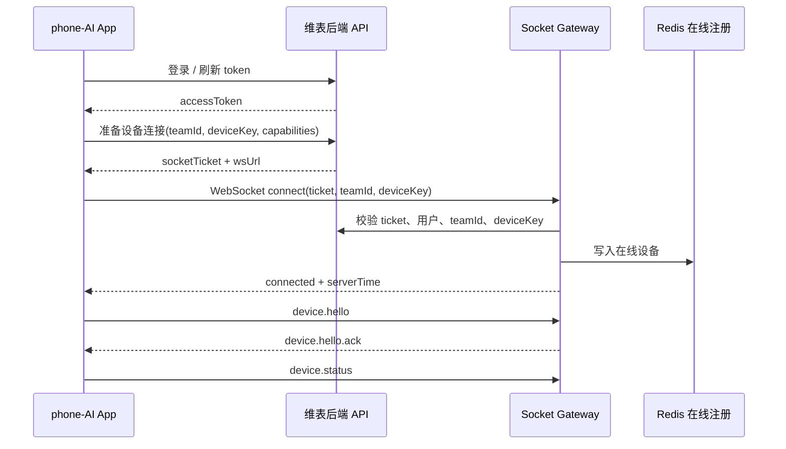
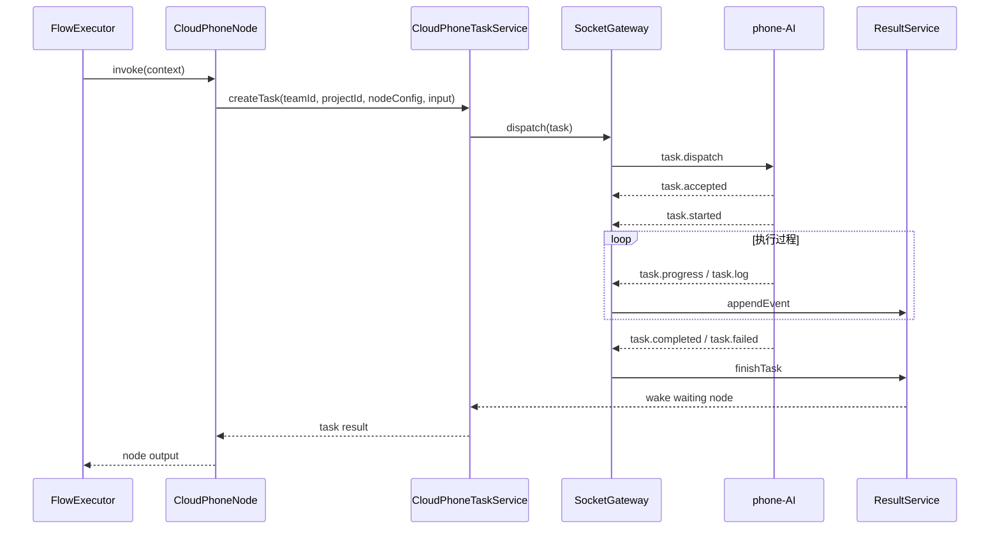
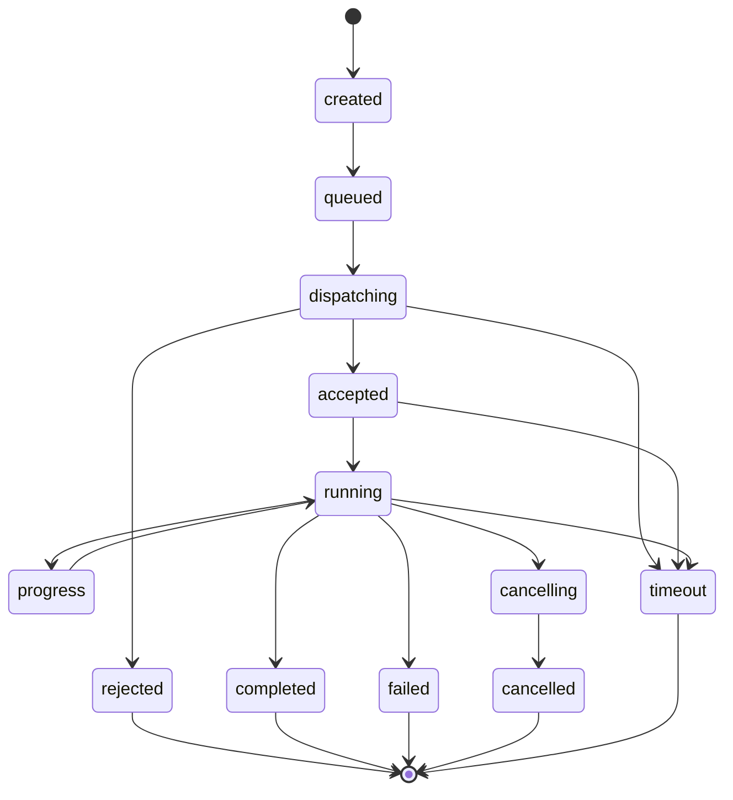
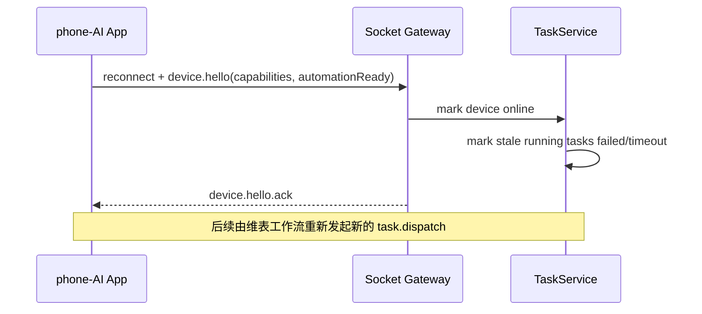
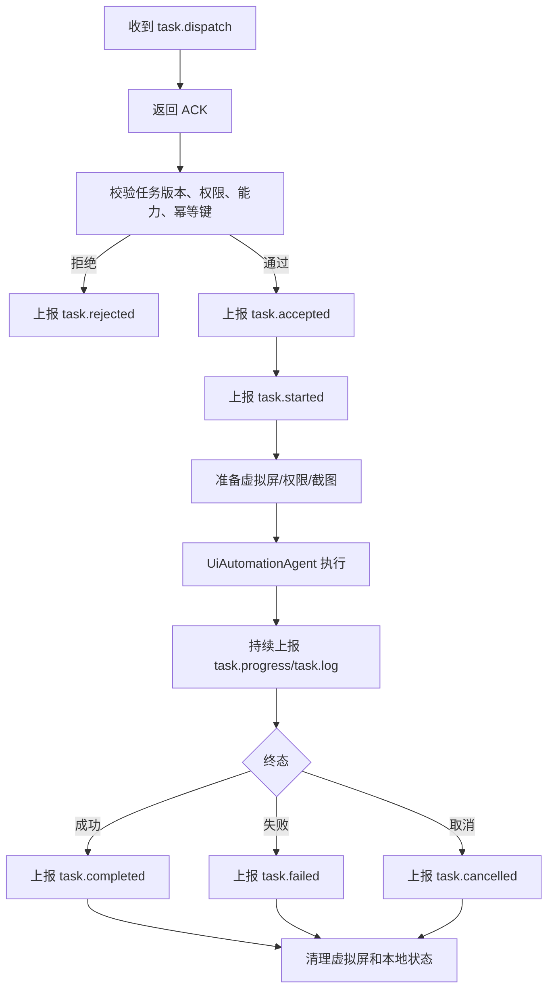

# Phone AI 结合维表工作流的架构设计

> 本文档用于设计 `phone-AI` 与维表系统的集成架构，重点覆盖 App 登录、设备在线 WebSocket、Socket 协议类型、维表工作流云手机节点远程控制手机、任务回执、断线恢复与幂等机制。
>
> 设计原则：复用 `phone-AI` 现有 Android 自动化引擎能力，复用维表 `server/src/modules/flow` 工作流运行体系；云手机 WebSocket 必须独立实现，不能改动、复用、挂载、代理或影响 Yjs 协同 Socket 以及其他现有 Socket；不绕过团队、项目和工作流权限边界。

## 1. 背景与目标

### 1.1 当前基础

`phone-AI` 已具备以下能力：

| 能力 | 当前文档依据 | 说明 |
| --- | --- | --- |
| Android UI 自动化 | `1.项目概述与核心特性.md`、`2.业务功能分析.md` | 通过截图、UI 树、LLM、动作解析器和动作执行器完成手机自动操作 |
| 虚拟屏隔离 | `3.架构设计.md`、`5.数据模型与设计模式.md` | 支持 VirtualDisplay、Shizuku、输入注入、截图预览，适合后台执行 |
| 远程控制模式草案 | `6.远程控制模式改造设计文档.md` | 已提出登录、WebSocket、任务下发、任务队列、状态管理等模块 |
| 维表工作流引擎 | `.trae/已开发文档/工作流架构设计.md` | 后端以 `FlowRunService + FlowExecutor + FlowContext + FlowNode` 执行工作流 |
| 工作流使用方式 | `.trae/使用方案/工作流的使用方案.md` | 工作流以 `flow_info` 定义，通过项目绑定落到具体业务入口 |

### 1.2 本次设计目标

1. App 支持登录系统，登录后生成稳定的设备身份。
2. App 登录后自动建立 WebSocket 长连接，并上报在线状态。
3. 定义 Socket 消息的统一 envelope、类型、状态码、任务协议和错误协议。
4. 支持维表工作流新增“云手机节点”，由工作流节点向在线手机下发任务。
5. 支持任务执行进度、完成、失败、取消、超时等回执。
6. 支持 Socket 中断后的设备重连、旧任务终止标记、新任务重新接收和幂等处理；不做未完成任务续跑。
7. 明确维表团队、项目、工作流、设备之间的权限与隔离关系。

### 1.3 非目标

| 非目标 | 说明 |
| --- | --- |
| 不改 Yjs 协同链路 | 云手机任务状态不通过 Yjs 广播驱动，不接入 Yjs 服务，不修改任何协同 Socket 代码 |
| 不影响其他 Socket | 云手机连接使用独立路径、独立网关、独立协议、独立连接注册表、独立数据表，不能和现有 Socket 混用 |
| 不直接控制用户物理主屏 | 默认优先使用 `phone-AI` 虚拟屏隔离能力，必要时才降级到无障碍或 Shizuku |
| 不让工作流节点直接持有 App token | 工作流只拿任务级授权上下文，设备登录 token 不暴露给节点配置 |
| 不把 WebSocket 当数据库 | 任务真值、设备状态、执行结果必须落库，Socket 只负责实时通道 |

### 1.4 Socket 隔离硬约束

云手机 WebSocket 是本设计的独立实时通道，不能借用或改造维表已有协同 Socket。后续实现时必须遵守以下硬约束：

| 约束项 | 要求 |
| --- | --- |
| 独立 URL | 使用 `/app/cloud-phone/ws` 或类似独立路径，不能挂到 Yjs 协同路径下 |
| 独立 Gateway | 新建 `CloudPhoneSocketGateway`，不能在 Yjs gateway、协同 gateway、消息 gateway 中追加云手机逻辑 |
| 独立协议 | 使用本文定义的 `protocolVersion/type/messageId/taskId/payload` 协议，不能复用 Yjs update、awareness、sync 协议 |
| 独立连接注册 | 使用 Redis 在线注册表和 `CloudPhoneConnectionRegistry`，不能写入协同在线用户表或复用协同连接池 |
| 独立鉴权 | 使用设备登录、socket ticket、设备绑定校验，不能复用协同房间鉴权 |
| 独立心跳 | 使用 `heartbeat.ping/pong`，不能接入协同心跳和 awareness 更新 |
| 独立消息广播 | 云手机消息只点对点投递到目标设备，不向表格协同房间广播 |
| 独立状态存储 | 云手机任务状态写入 `cloud_phone_task` 等表，不写入 Yjs 文档或协同状态 |
| 独立限流与熔断 | 云手机 Socket 单独限流，避免影响表格协同、通知、消息等实时链路 |
| 独立部署开关 | 可通过配置单独启停云手机 Socket，不影响其他 Socket 服务启动 |

一句话边界：**云手机 Socket 是工作流任务控制通道，不是协同通道；它只能服务云手机设备连接和任务投递，不能参与维表表格协同。**

## 2. 总体架构

### 2.1 系统边界

```mermaid
flowchart LR
    User([维表用户])

    subgraph Web[维表前端 web / ai-flow-web]
        FlowCanvas[工作流画布]
        FlowRunUI[运行/调试界面]
        DevicePanel[云手机设备选择面板]
    end

    subgraph Server[维表后端 server]
        Auth[统一登录与权限]
        FlowRun[FlowRunService]
        FlowExecutor[FlowExecutor]
        PhoneNode[CloudPhoneNode]
        TaskSvc[CloudPhoneTaskService]
        WsGateway[CloudPhoneSocketGateway]
        DeviceSvc[CloudPhoneDeviceService]
        ResultSvc[CloudPhoneResultService]
    end

    subgraph Redis[Redis 临时在线注册]
        OnlineDevice[(cloud_phone:online:{teamId}:{deviceKey})]
        TeamOnline[(cloud_phone:team:{teamId}:online_devices)]
    end

    subgraph DB[持久化]
        TaskDB[(cloud_phone_task)]
        EventDB[(cloud_phone_task_event)]
        FlowResult[(flow_result / flow_log)]
    end

    subgraph App[phone-AI Android App]
        Login[登录模块]
        WsClient[RemoteWebSocketClient]
        TaskQueue[RemoteTaskQueue]
        Dispatcher[RemoteTaskDispatcher]
        Agent[UiAutomationAgent]
        VDisplay[VirtualDisplayController]
    end

    User --> FlowCanvas
    FlowCanvas --> FlowRunUI
    FlowRunUI --> FlowRun
    FlowRun --> FlowExecutor
    FlowExecutor --> PhoneNode
    PhoneNode --> TaskSvc
    TaskSvc --> TaskDB
    TaskSvc --> WsGateway
    WsGateway <-->|wss| WsClient
    Login --> WsClient
    WsClient --> TaskQueue
    TaskQueue --> Dispatcher
    Dispatcher --> Agent
    Agent --> VDisplay
    Dispatcher --> WsClient
    WsGateway --> ResultSvc
    ResultSvc --> TaskDB
    ResultSvc --> EventDB
    ResultSvc --> FlowResult
    DeviceSvc --> OnlineDevice
    WsGateway --> OnlineDevice
    WsGateway --> TeamOnline
    Auth --> DeviceSvc
```

### 2.2 架构分层

| 层级 | 模块 | 职责 |
| --- | --- | --- |
| App 登录层 | `RemoteAuthManager`、`CasdoorAuthManager` 或维表统一 OIDC 适配 | 登录、刷新 token、获取用户信息、生成设备身份 |
| App 长连接层 | `RemoteWebSocketService`、`RemoteWebSocketClient` | 建立 WebSocket、心跳、重连、消息收发、ACK |
| App 任务层 | `RemoteTaskQueue`、`RemoteTaskDispatcher` | 任务排队、互斥执行、取消、暂停、终态上报 |
| App 自动化层 | `UiAutomationAgent`、`VirtualDisplayController`、`ActionExecutor` | 执行手机 UI 自动化任务，返回进度和结果 |
| 后端连接层 | `CloudPhoneSocketGateway` | 设备鉴权、连接管理、路由下发、在线状态维护 |
| 后端任务层 | `CloudPhoneTaskService`、`CloudPhoneResultService` | 任务创建、状态流转、事件落库、断线失败标记 |
| 后端工作流节点层 | `CloudPhoneNode` | 作为工作流节点调用云手机任务，并把执行结果写回 `FlowContext` |
| 权限与隔离层 | 团队、项目、工作流、设备绑定 | 保证用户只能选择和控制自己有权限的设备 |

## 3. 登录与设备身份设计

### 3.1 登录方式

App 侧使用与维表一致的登录体系，推荐通过 OIDC 或维表统一登录页完成授权码登录。`6.远程控制模式改造设计文档.md` 中已提出 Casdoor OIDC 方案，若维表当前统一认证不是 Casdoor，则抽象为 `RemoteAuthProvider`，不要把认证供应商硬编码到业务层。

```kotlin
interface RemoteAuthProvider {
    suspend fun login(): LoginResult
    suspend fun refreshToken(): TokenResult
    suspend fun logout()
    suspend fun currentSession(): AuthSession?
}
```

### 3.2 登录成功后的设备注册

登录成功后，App 调用后端设备临时注册接口。线上不持久化在线设备和连接会话，Socket 在线信息只写 Redis：

```http
POST /app/cloud-phone/device/prepare
Authorization: Bearer <accessToken>
Content-Type: application/json
```

请求体：

```json
{
  "teamId": "team_1",
  "deviceKey": "sha256(androidId + installId + packageName)",
  "deviceName": "Pixel 8 Pro",
  "platform": "android",
  "appVersion": "v1.4.2-xyla.alpha",
  "capabilities": {
    "virtualDisplay": true,
    "shizuku": true,
    "accessibility": true,
    "screenshot": true,
    "uiTree": true,
    "maxConcurrentTasks": 1
  }
}
```

返回体：

```json
{
  "teamId": "team_1",
  "deviceKey": "sha256(...)",
  "deviceCode": "team_1:sha256(...)",
  "wsUrl": "wss://api.example.com/app/cloud-phone/ws",
  "socketTicket": "one-time-ticket",
  "ticketExpiresAt": 1760000000000
}
```

### 3.3 设备身份字段

| 字段 | 生成方 | 是否稳定 | 用途 |
| --- | --- | --- | --- |
| `installId` | App 本地首次启动生成 | 卸载后变化 | 本地安装实例标识 |
| `deviceKey` | App 本地生成 hash | 尽量稳定 | 设备唯一信息编码，如 `sha256(androidId + installId + packageName)` |
| `deviceCode` | App/后端约定生成 | 稳定 | `teamId + deviceKey` 组合编码，用于 Redis key 和任务路由 |
| `connectionId` | 网关生成 | 单连接有效 | 网关内路由标识 |

### 3.4 权限绑定

在线设备按团队维度临时注册，不落库保存连接信息：

| 绑定层级 | 说明 |
| --- | --- |
| 团队维度 | Redis key 使用 `teamId + deviceKey`，表示该设备当前在线归属于哪个团队 |
| 用户维度 | Redis value 可记录 `userId/operatorUserId`，用于审计和可见性判断 |
| 项目维度 | 项目不持有设备，只在运行工作流时读取团队在线设备 |
| 工作流节点 | 节点引用 `deviceSelector`，运行时从 Redis 在线设备中选择具体设备 |

工作流运行时需要同时校验：

1. 当前运行用户是否属于 `teamId`。
2. 当前工作流是否属于或可用于该 `teamId`。
3. 当前项目是否已挂载该工作流。
4. 当前用户是否有运行该工作流的权限。
5. 目标设备是否在 Redis 中属于该团队在线设备集合。
6. 目标设备是否处于可调度状态。

## 4. WebSocket 连接设计

### 4.1 连接入口

```text
wss://<server-host>/app/cloud-phone/ws?ticket=<socketTicket>&teamId=<teamId>&deviceKey=<deviceKey>&protocolVersion=1
```

连接时只允许使用短期 `socketTicket` 或服务端签发的 WebSocket 专用 token，不建议直接把长期 access token 放在 URL 中。若必须传 token，应通过 `Authorization` header 传递。

该入口必须是云手机专用入口，不允许与以下连接入口共用：

| 禁止共用对象 | 原因 |
| --- | --- |
| Yjs 协同 Socket | 协同链路需要低延迟和稳定广播，云手机任务流量可能包含日志、截图、长任务状态，会污染协同链路 |
| 在线用户/awareness Socket | 云手机状态不是表格光标、选区、在线成员状态，语义不同 |
| 通知/消息 Socket | 云手机任务需要 ACK、任务状态机和断线恢复，不能用普通通知语义承载 |
| 其他业务 Socket | 防止云手机断线重连、任务重发、限流策略影响其他实时业务 |

推荐服务端路径和命名：

```text
HTTP 设备准备：/app/cloud-phone/device/prepare
HTTP 任务查询：/app/cloud-phone/task/:taskId
WS 设备连接：/app/cloud-phone/ws
Gateway 名称：CloudPhoneSocketGateway
模块目录：server/src/modules/cloud-phone
```

### 4.2 连接建立流程



### 4.3 在线状态

设备在线状态分为连接状态和调度状态：

| 状态 | 说明 | 是否可接任务 |
| --- | --- | --- |
| `offline` | 无有效 Socket 连接 | 否 |
| `online` | 已连接且心跳正常 | 是 |
| `busy` | 正在执行任务 | 否，除非设备支持并发 |
| `paused` | 用户暂停远程控制 | 否 |
| `maintenance` | 维护中或版本不兼容 | 否 |
| `error` | 权限缺失或自动化引擎不可用 | 否 |

在线状态只以 Redis 为准：

| Redis 数据 | 说明 |
| --- | --- |
| 连接建立 | 写入 `cloud_phone:online:{teamId}:{deviceKey}`，并把 `deviceKey` 加入 `cloud_phone:team:{teamId}:online_devices` |
| 心跳续期 | 刷新 `cloud_phone:online:{teamId}:{deviceKey}` 的 TTL 和状态字段 |
| 正常断开 | 删除 `cloud_phone:online:{teamId}:{deviceKey}`，并从团队在线集合移除 |
| 异常断开 | 网关收到 close/error 时删除；兜底依赖 TTL 自动过期 |
| 前端管理页 | 直接读取 Redis 团队在线集合展示在线云手机 |
| 云手机节点 | 直接读取 Redis 团队在线集合选择设备 |

### 4.4 心跳机制

| 方向 | 类型 | 周期 | 说明 |
| --- | --- | --- | --- |
| App -> Server | `heartbeat.ping` | 20-30 秒 | 携带 App 状态、当前任务、权限状态 |
| Server -> App | `heartbeat.pong` | 收到 ping 后立即返回 | 携带服务器时间和连接建议 |
| Server 检测 | 心跳超时 | 2-3 个周期 | 标记连接疑似离线 |

心跳请求示例：

```json
{
  "type": "heartbeat.ping",
  "messageId": "msg_1001",
  "deviceKey": "sha256-device-a",
  "deviceCode": "team_1:sha256-device-a",
  "timestamp": 1760000000000,
  "payload": {
    "currentTaskId": "cpt_01H...",
    "battery": 82,
    "network": "wifi",
    "automationReady": true,
    "permissions": {
      "accessibility": true,
      "shizuku": true,
      "overlay": true
    }
  }
}
```

### 4.5 与其他 Socket 的隔离策略

| 维度 | 云手机 Socket | Yjs/其他 Socket |
| --- | --- | --- |
| 连接对象 | Android 设备 App | 浏览器用户、协同客户端或其他业务客户端 |
| 核心语义 | 任务投递、任务回执、设备在线 | 文档协同、在线状态、业务通知 |
| 消息模型 | 强 ACK、不可续跑、断线后由工作流重新发起 | 按各自业务协议处理 |
| 状态真值 | `cloud_phone_*` 数据表 | 各自原有存储 |
| 广播范围 | 默认点对点到设备 | 按原业务房间或用户广播 |
| 限流策略 | 按设备、任务、团队限流 | 不共享限流桶 |
| 故障影响 | 只影响云手机任务 | 不影响协同和其他实时业务 |

实现时禁止在云手机 Socket 里调用 Yjs `notify`、`broadcastAwareness`、`applyUpdate`、协同房间广播等能力。若工作流结果需要展示到前端，只通过任务查询、工作流日志、工作流运行结果接口获取，不从协同 Socket 推送。

## 5. Socket 协议设计

### 5.1 Envelope

所有消息使用统一 envelope：

```json
{
  "protocolVersion": 1,
  "type": "task.dispatch",
  "messageId": "msg_01H...",
  "correlationId": "run_01H...",
  "taskId": "cpt_01H...",
  "deviceKey": "sha256-device-a",
  "deviceCode": "team_1:sha256-device-a",
  "timestamp": 1760000000000,
  "requiresAck": true,
  "payload": {}
}
```

| 字段 | 必填 | 说明 |
| --- | --- | --- |
| `protocolVersion` | 是 | 协议版本，首版为 `1` |
| `type` | 是 | 消息类型 |
| `messageId` | 是 | 消息唯一 ID，用于 ACK 和去重 |
| `correlationId` | 否 | 工作流运行、调试或外部请求链路 ID |
| `taskId` | 否 | 云手机任务 ID |
| `deviceKey` | 否 | 目标设备或来源设备唯一信息编码 |
| `deviceCode` | 否 | `teamId + deviceKey` 组合编码 |
| `timestamp` | 是 | 发送端时间戳 |
| `requiresAck` | 是 | 是否要求业务 ACK |
| `payload` | 是 | 类型相关载荷 |

### 5.2 通用 ACK

```json
{
  "protocolVersion": 1,
  "type": "ack",
  "messageId": "msg_ack_01H...",
  "ackOf": "msg_01H...",
  "timestamp": 1760000000100,
  "payload": {
    "accepted": true,
    "code": "OK",
    "message": "accepted"
  }
}
```

ACK 只表示消息已被接收或拒收，不等同于任务完成。任务完成必须通过 `task.completed` 或 `task.failed` 上报。

### 5.3 消息类型总表

| 类型 | 方向 | 说明 | 是否落库 |
| --- | --- | --- | --- |
| `connection.connected` | Server -> App | 连接建立成功 | 是 |
| `device.hello` | App -> Server | 设备能力、版本和当前可用状态上报 | 是 |
| `device.hello.ack` | Server -> App | 设备握手确认 | 是 |
| `device.status` | App -> Server | 设备状态变化 | 是 |
| `heartbeat.ping` | App -> Server | 心跳 | 可采样 |
| `heartbeat.pong` | Server -> App | 心跳响应 | 可采样 |
| `task.dispatch` | Server -> App | 下发任务 | 是 |
| `task.accepted` | App -> Server | App 接受任务 | 是 |
| `task.rejected` | App -> Server | App 拒绝任务 | 是 |
| `task.started` | App -> Server | 任务开始执行 | 是 |
| `task.progress` | App -> Server | 任务进度 | 是，可压缩 |
| `task.log` | App -> Server | 任务日志 | 是，可压缩 |
| `task.screenshot` | App -> Server | 关键截图或缩略图 | 按策略 |
| `task.completed` | App -> Server | 任务完成 | 是 |
| `task.failed` | App -> Server | 任务失败 | 是 |
| `task.cancel` | Server -> App | 服务端要求取消任务 | 是 |
| `task.cancelled` | App -> Server | App 确认已取消 | 是 |
| `error` | 双向 | 协议或业务错误 | 是 |

### 5.4 任务下发 payload

```json
{
  "type": "task.dispatch",
  "messageId": "msg_dispatch_01H...",
  "correlationId": "flow_run_01H...",
  "taskId": "cpt_01H...",
  "deviceKey": "sha256-device-a",
  "deviceCode": "team_1:sha256-device-a",
  "requiresAck": true,
  "payload": {
    "source": {
      "teamId": "team_1",
      "projectId": "project_1",
      "flowId": 1001,
      "nodeId": "node_cloud_phone_1",
      "runId": "flow_run_01H...",
      "operatorUserId": "user_1"
    },
    "instruction": "打开微信，给张三发送项目已完成",
    "execution": {
      "mode": "virtual_display",
      "maxSteps": 50,
      "timeoutMs": 300000,
      "priority": 5,
      "allowSensitiveAction": false,
      "needFinalScreenshot": true
    },
    "model": {
      "mode": "app_default",
      "configId": null
    },
    "input": {
      "variables": {
        "customerName": "张三",
        "message": "项目已完成"
      }
    },
    "idempotencyKey": "team_1:flow_run_01H:node_cloud_phone_1:cpt_01H"
  }
}
```

### 5.5 任务结果 payload

```json
{
  "type": "task.completed",
  "messageId": "msg_done_01H...",
  "correlationId": "flow_run_01H...",
  "taskId": "cpt_01H...",
  "deviceKey": "sha256-device-a",
  "deviceCode": "team_1:sha256-device-a",
  "payload": {
    "success": true,
    "status": "completed",
    "steps": 18,
    "durationMs": 86420,
    "message": "任务已完成",
    "outputs": {
      "finalText": "已给张三发送消息",
      "targetApp": "wechat"
    },
    "artifacts": [
      {
        "type": "screenshot",
        "url": "oss://cloud-phone/tasks/cpt_01H/final.png",
        "name": "final"
      }
    ]
  }
}
```

### 5.6 错误码

| 错误码 | 触发场景 | 是否可重试 |
| --- | --- | --- |
| `AUTH_EXPIRED` | App token 或 socket ticket 过期 | 是，刷新登录 |
| `DEVICE_NOT_BOUND` | 设备未绑定当前团队或用户 | 否 |
| `DEVICE_BUSY` | 设备正在执行其他任务 | 是，排队或换设备 |
| `DEVICE_NOT_READY` | 无障碍、Shizuku、虚拟屏等权限缺失 | 否，需用户处理 |
| `PROTOCOL_VERSION_UNSUPPORTED` | 协议版本不兼容 | 否，需升级 |
| `TASK_DUPLICATED` | 幂等键重复 | 否，返回已有任务 |
| `TASK_TIMEOUT` | 执行超时 | 可按策略重试 |
| `TASK_CANCELLED` | 用户或服务端取消 | 否 |
| `AUTOMATION_FAILED` | 自动化引擎执行失败 | 可按节点策略重试 |
| `SENSITIVE_ACTION_BLOCKED` | 敏感操作被二次确认策略拦截 | 否，需人工确认 |

## 6. 维表工作流云手机节点设计

### 6.1 节点定位

新增工作流节点：`CloudPhoneNode`。

该节点是后端 `FlowNode` 子类，职责是把工作流上下文转换成云手机任务，等待任务完成或失败，再把结果写回 `FlowContext`，供后续节点继续使用。



### 6.2 节点配置

| 配置项 | 类型 | 说明 |
| --- | --- | --- |
| `deviceSelector` | object | 指定单设备、多个候选设备或随机在线设备选择策略 |
| `instructionTemplate` | string | 任务指令模板，支持引用上游变量 |
| `executionMode` | enum | `virtual_display`、`accessibility`、`shizuku`、`auto` |
| `timeoutMs` | number | 单任务超时时间 |
| `maxSteps` | number | 自动化最大步数 |
| `retryPolicy` | object | 节点级重试策略 |
| `sensitivePolicy` | enum | `block`、`require_confirm`、`allow` |
| `waitForCompletion` | boolean | 是否等待手机任务结束后再继续工作流 |
| `outputMapping` | object | 将任务结果映射到工作流变量 |

设备选择策略：

```json
{
  "deviceSelector": {
    "mode": "random_online",
    "deviceKeys": [
      "sha256-device-a",
      "sha256-device-b",
      "sha256-device-c"
    ],
    "requiredCapabilities": ["virtualDisplay", "screenshot", "uiTree"],
    "preferIdle": true
  }
}
```

支持的选择模式：

| 模式 | 配置 | 说明 |
| --- | --- | --- |
| `single` | `deviceKey` | 只选择指定手机；若该手机不在线或忙碌，任务失败或排队 |
| `random_online` | `deviceKeys[]` | 从多个候选手机中读取 Redis 在线状态，随机选择一个可用设备 |
| `team_random_online` | 无需指定设备列表 | 从当前团队 Redis 在线设备集合中随机选择一个可用设备 |

随机选择规则：

1. 只从 `cloud_phone:team:{teamId}:online_devices` 里选择。
2. 若节点配置了 `deviceKeys[]`，先和团队在线集合取交集。
3. 过滤 `busy`、`paused`、`maintenance`、`error` 状态设备。
4. 过滤不满足 `requiredCapabilities` 的设备。
5. 对剩余设备随机选择一个，并在任务创建时写入 `deviceKey/deviceCode`。
6. 如果没有可用设备，任务返回 `NO_ONLINE_DEVICE` 或进入队列，具体由节点配置决定。

### 6.3 节点输出

```json
{
  "success": true,
  "taskId": "cpt_01H...",
  "deviceKey": "sha256-device-a",
  "deviceCode": "team_1:sha256-device-a",
  "status": "completed",
  "message": "任务已完成",
  "steps": 18,
  "durationMs": 86420,
  "outputs": {
    "finalText": "已给张三发送消息",
    "targetApp": "wechat"
  },
  "artifacts": [
    {
      "type": "screenshot",
      "url": "oss://cloud-phone/tasks/cpt_01H/final.png"
    }
  ]
}
```

### 6.4 同步等待与异步等待

| 模式 | 说明 | 适用场景 |
| --- | --- | --- |
| 同步等待 | `CloudPhoneNode` 创建任务后等待完成，节点返回最终结果 | 调试、短任务、后续节点依赖手机结果 |
| 异步等待 | 节点只创建任务并返回 `taskId`，后续通过回调或查询获取结果 | 长任务、批量任务、人机协同任务 |

第一阶段建议先做同步等待，原因是更符合现有 `FlowExecutor` 节点执行模型；异步等待和长任务 checkpoint 暂不纳入 MVP。

## 7. 任务状态机

### 7.1 状态定义



### 7.2 状态表

| 状态 | 写入方 | 说明 |
| --- | --- | --- |
| `created` | 后端 | 任务已创建，尚未调度 |
| `queued` | 后端 | 等待设备空闲 |
| `dispatching` | 后端 | 已通过 Socket 下发，等待 ACK |
| `accepted` | App | App 已接受任务 |
| `rejected` | App | App 拒绝任务 |
| `running` | App | 自动化执行中 |
| `completed` | App | 执行成功 |
| `failed` | App | 执行失败 |
| `cancelling` | 后端 | 服务端请求取消 |
| `cancelled` | App | App 已停止任务 |
| `timeout` | 后端 | ACK 或执行超时 |

### 7.3 状态流转约束

1. 只有 `created`、`queued` 任务可以进入 `dispatching`。
2. 只有收到 `task.accepted` 后才能进入 `running`。
3. `completed`、`failed`、`cancelled`、`timeout` 是终态，不允许再次变更。
4. 所有状态更新必须带 `taskId`、`messageId`、`eventSeq`。
5. 后端按 `taskId + eventSeq` 去重，避免重连后重复上报。

## 8. 断线终止与重新发起机制

### 8.1 断线场景

| 场景 | 后端处理 | App 处理 |
| --- | --- | --- |
| App 执行中断网 | 当前任务标记为 `failed` 或 `timeout`，错误码 `DEVICE_DISCONNECTED` | 停止当前远程任务上下文，重连后只上报设备可用状态 |
| App 长时间离线 | 设备标记 `offline`，运行中的任务进入终态失败 | 恢复连接后等待新任务，不续跑旧任务 |
| 服务端重启 | 内存连接丢失，运行中的任务按超时或断线失败处理 | 自动重连，重新 `device.hello`，只接收后续新任务 |
| 网关切换 | 原连接失效，运行中的投递不做续跑 | 自动重连新网关 |
| App 进程被杀 | 未完成任务视为中断失败 | 重启后重新登录/连接，等待维表重新发起任务 |

### 8.2 不续跑原则

云手机任务断线后不做“恢复未执行完的任务”。原因如下：

| 原因 | 说明 |
| --- | --- |
| 手机 UI 状态不可证明 | 断线期间页面可能变化，继续执行容易误操作 |
| 自动化动作不可安全回放 | 点击、输入、发送消息等动作可能已经部分生效 |
| 工作流侧可重新发起 | 维表工作流节点失败后，由工作流重试策略重新创建新任务 |
| 实现成本更低 | 不需要 App 维护复杂本地快照、步骤恢复和动作幂等 |
| 安全边界更清晰 | 旧任务失败，新任务重新授权、重新下发、重新记录审计 |

### 8.3 App 重连流程

App 重连只恢复“设备在线能力”，不恢复旧任务：



### 8.4 维表重新发起任务

断线导致当前任务失败后，是否重新执行由维表工作流控制：

| 策略 | 说明 |
| --- | --- |
| 节点不重试 | `CloudPhoneNode` 返回失败，工作流按失败链路结束或走异常分支 |
| 节点自动重试 | `CloudPhoneNode` 根据 `retryPolicy` 创建新的 `cloud_phone_task`，重新下发 |
| 上游重新触发 | 用户或自动化规则重新运行工作流，生成新的 `flowRunId/taskId` |
| 换设备重试 | 后端可选择其他在线设备创建新任务，但仍是新任务，不是旧任务续跑 |

新任务必须生成新的 `taskId` 和新的审计事件；可以沿用同一 `flowRunId` 的重试 attempt，也可以由新的工作流运行生成全新的 `flowRunId`。

### 8.5 重连退避

| 次数 | 等待时间 |
| --- | --- |
| 1 | 1 秒 |
| 2 | 2 秒 |
| 3 | 5 秒 |
| 4 | 10 秒 |
| 5+ | 30 秒，带随机抖动 |

出现 `AUTH_EXPIRED` 时优先刷新 token 并重新申请 `socketTicket`，不要无限重连。

### 8.6 幂等策略

| 对象 | 幂等键 | 处理方式 |
| --- | --- | --- |
| 任务创建 | `teamId + flowRunId + nodeId + nodeAttempt` | 同一 attempt 重复请求返回已有任务；重试必须增加 attempt 或创建新 flowRun |
| Socket 消息 | `messageId` | 已处理消息直接返回 ACK |
| 任务事件 | `taskId + eventSeq` | 只追加未见过的事件 |
| 任务终态 | `taskId` | 终态只允许写入一次 |

## 9. Redis 在线注册与后端数据模型建议

### 9.1 Redis 在线设备注册

线上不在数据库存储连接设备信息，在线设备只写 Redis。Redis 数据是临时状态，Socket 连接建立时注册，Socket 断开时删除，异常情况下依赖 TTL 自动过期。

#### 9.1.1 单设备在线 Key

```text
cloud_phone:online:{teamId}:{deviceKey}
```

Value 建议使用 JSON：

```json
{
  "teamId": "team_1",
  "deviceKey": "sha256-device-a",
  "deviceCode": "team_1:sha256-device-a",
  "deviceName": "Pixel 8 Pro",
  "userId": "user_1",
  "connectionId": "conn_01H...",
  "gatewayId": "gateway_1",
  "status": "online",
  "busy": false,
  "platform": "android",
  "appVersion": "v1.4.2-xyla.alpha",
  "capabilities": {
    "virtualDisplay": true,
    "shizuku": true,
    "accessibility": true,
    "screenshot": true,
    "uiTree": true,
    "maxConcurrentTasks": 1
  },
  "connectedAt": 1760000000000,
  "lastHeartbeatAt": 1760000010000
}
```

TTL 建议为心跳周期的 3 到 4 倍，例如心跳 30 秒，TTL 设置 90 到 120 秒。每次心跳刷新 TTL。

#### 9.1.2 团队在线集合

```text
cloud_phone:team:{teamId}:online_devices
```

类型建议使用 Set，成员为 `deviceKey`。连接建立时 `SADD`，断开时 `SREM`。前端管理页和云手机节点都从这个 Set 读取团队在线设备列表，再批量读取 `cloud_phone:online:{teamId}:{deviceKey}` 获取详情。

#### 9.1.3 忙碌状态

```text
cloud_phone:busy:{teamId}:{deviceKey}
```

当设备开始执行任务时写入，任务终态或 Socket 断开时删除。随机选择在线设备时必须排除 busy key 存在的设备。

Value 示例：

```json
{
  "taskId": "cpt_01H...",
  "flowRunId": "flow_run_01H...",
  "startedAt": 1760000000000,
  "timeoutAt": 1760000300000
}
```

### 9.2 Redis 生命周期

| 时机 | Redis 操作 |
| --- | --- |
| Socket 连接鉴权成功 | `SET cloud_phone:online:{teamId}:{deviceKey}` + `SADD cloud_phone:team:{teamId}:online_devices` |
| 心跳 | 刷新 online key TTL，更新 `lastHeartbeatAt/status/capabilities` |
| 任务开始 | `SET cloud_phone:busy:{teamId}:{deviceKey}` |
| 任务完成/失败/取消/超时 | 删除 busy key |
| Socket 正常断开 | 删除 online key、busy key，并 `SREM` 团队在线集合 |
| Socket 异常断开 | 网关 close/error 尝试删除；失败时依赖 TTL 过期 |
| 前端管理页查询 | `SMEMBERS` 团队在线集合，再批量 `GET` online key |
| 云手机节点选设备 | 从 Redis 读取在线集合，过滤能力和 busy 状态，按策略选择 |

### 9.3 `cloud_phone_task`

| 字段 | 类型 | 说明 |
| --- | --- | --- |
| `id` | varchar | 任务 ID |
| `teamId` | varchar | 团队隔离 |
| `projectId` | varchar | 项目隔离 |
| `flowId` | int | 工作流 ID |
| `flowRunId` | varchar | 工作流运行 ID |
| `nodeId` | varchar | 节点 ID |
| `deviceKey` | varchar | 目标设备唯一信息编码 |
| `deviceCode` | varchar | `teamId + deviceKey` 组合编码 |
| `operatorUserId` | varchar | 触发用户 |
| `status` | varchar | 任务状态 |
| `instruction` | text | 渲染后的任务指令 |
| `config` | json | 执行配置 |
| `input` | json | 输入变量 |
| `output` | json | 输出结果 |
| `errorCode` | varchar | 错误码 |
| `errorMessage` | text | 错误信息 |
| `idempotencyKey` | varchar | 幂等键，唯一索引 |
| `createdAt` | datetime | 创建时间 |
| `startedAt` | datetime | 开始时间 |
| `finishedAt` | datetime | 结束时间 |

### 9.4 `cloud_phone_task_event`

| 字段 | 类型 | 说明 |
| --- | --- | --- |
| `id` | bigint | 自增 ID |
| `taskId` | varchar | 任务 ID |
| `eventSeq` | int | App 侧事件序号 |
| `type` | varchar | 事件类型 |
| `messageId` | varchar | Socket 消息 ID |
| `payload` | json | 事件内容 |
| `createdAt` | datetime | 创建时间 |

索引建议：

| 表 | 索引 |
| --- | --- |
| `cloud_phone_task` | `(teamId, projectId, flowRunId)`、`(teamId, deviceKey, status)`、`idempotencyKey unique` |
| `cloud_phone_task_event` | `(taskId, eventSeq) unique`、`(taskId, createdAt)` |

## 10. App 端模块设计

### 10.1 建议新增包结构

沿用 `6.远程控制模式改造设计文档.md` 的独立包原则：

```text
app/src/main/java/com/ai/phoneagent/remote/
├── auth/
│   ├── RemoteAuthProvider.kt
│   ├── RemoteAuthManager.kt
│   └── RemoteTokenStore.kt
├── device/
│   ├── DeviceRegistrationClient.kt
│   ├── DeviceIdentityStore.kt
│   └── DeviceCapabilityCollector.kt
├── socket/
│   ├── RemoteWebSocketService.kt
│   ├── RemoteWebSocketClient.kt
│   ├── RemoteSocketProtocol.kt
│   ├── RemoteMessageAckManager.kt
│   └── RemoteReconnectPolicy.kt
├── task/
│   ├── RemoteTaskQueue.kt
│   ├── RemoteTaskDispatcher.kt
│   ├── RemoteTaskEventReporter.kt
│   └── RemoteTaskCancellation.kt
├── state/
│   ├── RemoteStateManager.kt
│   └── RemoteDeviceStatus.kt
└── di/
    └── RemoteModule.kt
```

### 10.2 关键职责

| 模块 | 职责 |
| --- | --- |
| `RemoteAuthManager` | 管理登录、登出、刷新 token、登录态恢复 |
| `DeviceRegistrationClient` | 注册设备、刷新能力、获取 socket ticket |
| `RemoteWebSocketService` | Android 前台 Service，负责长连接保活 |
| `RemoteWebSocketClient` | OkHttp WebSocket 收发、解析 envelope |
| `RemoteMessageAckManager` | 管理 ACK、重发、去重 |
| `RemoteTaskQueue` | 单设备任务队列，保证默认同一时间只跑一个任务 |
| `RemoteTaskDispatcher` | 把远程任务转换为 `UiAutomationAgent` 可执行任务 |
| `RemoteTaskEventReporter` | 上报 accepted/started/progress/completed/failed |

### 10.3 App 端任务执行流程



## 11. 后端模块设计

### 11.1 建议新增目录

```text
server/src/modules/cloud-phone/
├── controller/
│   ├── app-device.ts
│   ├── app-task.ts
│   └── socket.ts
├── entity/
│   ├── task.ts
│   └── task-event.ts
├── service/
│   ├── online-device-registry.ts
│   ├── device-selector.ts
│   ├── socket-ticket.ts
│   ├── connection-registry.ts
│   ├── task.ts
│   ├── result.ts
│   └── scheduler.ts
├── protocol/
│   ├── envelope.ts
│   ├── types.ts
│   └── errors.ts
└── flow-node/
    └── cloud-phone.node.ts
```

该目录必须作为独立业务模块维护，不把云手机 WebSocket 逻辑散落到现有 Yjs、协同、消息或通知模块中。唯一允许的跨模块依赖是：

| 依赖对象 | 允许原因 |
| --- | --- |
| 用户认证服务 | 校验登录用户 |
| 团队/项目权限服务 | 校验 `teamId`、`projectId` 访问边界 |
| 工作流运行服务 | `CloudPhoneNode` 作为工作流节点被调用 |
| 通用数据库/缓存封装 | Redis 保存在线设备和连接状态，数据库保存任务与事件 |

禁止依赖：

| 禁止依赖 | 原因 |
| --- | --- |
| Yjs 协同服务 | 避免任务事件进入表格协同链路 |
| 协同在线用户连接池 | 云手机设备不是表格协同用户连接 |
| 协同房间广播能力 | 云手机任务必须点对点投递到设备 |
| 其他业务 Socket gateway | 避免协议、心跳、限流、重连互相污染 |

### 11.2 服务职责

| 服务 | 职责 |
| --- | --- |
| `CloudPhoneOnlineDeviceRegistry` | Socket 连接后向 Redis 注册在线设备，断开后删除 Redis 数据 |
| `CloudPhoneDeviceSelector` | 从 Redis 团队在线设备中按单设备、多候选随机、团队随机策略选设备 |
| `CloudPhoneSocketTicketService` | 生成短期 socket ticket，防止长期 token 暴露 |
| `CloudPhoneConnectionRegistry` | 维护 `teamId + deviceKey -> connectionId` 路由，底层状态写 Redis |
| `CloudPhoneSocketGateway` | WebSocket 鉴权、消息解析、ACK、连接生命周期 |
| `CloudPhoneTaskService` | 创建任务、调度设备、下发任务、等待结果 |
| `CloudPhoneResultService` | 处理任务事件和终态结果，写入工作流输出 |
| `CloudPhoneSchedulerService` | 处理排队、超时、重试、设备忙碌 |
| `CloudPhoneNode` | 工作流节点适配层 |

### 11.3 与工作流引擎的关系

`CloudPhoneNode` 不直接操作 Socket 连接，也不直接更新设备状态，只依赖 `CloudPhoneTaskService`：

```typescript
class CloudPhoneNode extends FlowNode {
  async invoke(context: FlowContext) {
    const input = this.getInputParams(context);
    const task = await this.cloudPhoneTaskService.createAndDispatch({
      teamId: context.teamId,
      projectId: context.projectId,
      flowId: context.flowId,
      flowRunId: context.reqId,
      nodeId: this.node.id,
      operatorUserId: context.userId,
      input,
      config: this.node.data,
    });

    return await this.cloudPhoneTaskService.waitForResult(task.id);
  }
}
```

这样可以让节点保持薄适配，任务调度、Socket 路由、断线失败标记和重新发起策略都在云手机服务内部闭环。

## 12. 安全与权限设计

### 12.1 鉴权边界

| 操作 | 鉴权点 |
| --- | --- |
| App 登录 | 用户登录体系 |
| 设备注册 | 用户 token |
| Socket 连接 | 短期 socket ticket + `teamId + deviceKey` |
| 工作流运行 | 维表现有团队、项目、工作流权限 |
| 设备选择 | 从 Redis 团队在线设备中选择，且必须属于当前 `teamId` |
| 任务下发 | 工作流运行上下文 + 设备授权 |
| 任务结果查询 | `teamId + projectId + flowRunId` 权限 |

### 12.2 敏感操作控制

维表工作流节点默认不允许执行高风险操作：

| 操作 | 默认策略 |
| --- | --- |
| 支付、转账、付款 | 阻断 |
| 读取验证码 | 阻断或要求人工确认 |
| 修改账号密码 | 阻断 |
| 发送外部消息 | 可执行，但应记录审计 |
| 删除数据 | 要求节点显式开启，并记录审计 |

App 侧应继续复用 `phone-AI` 现有敏感内容保护机制，后端也要记录节点配置中的 `sensitivePolicy`。

### 12.3 审计日志

每次云手机任务至少记录：

1. 谁触发：`operatorUserId`。
2. 在哪个团队、项目、工作流、节点触发。
3. 使用哪个设备。
4. 下发了什么指令模板和渲染后的指令。
5. 执行开始、结束、失败原因。
6. 关键截图或日志 artifact。

## 13. 可靠性设计

### 13.1 超时策略

| 阶段 | 默认超时 | 处理 |
| --- | --- | --- |
| Socket ACK | 10 秒 | 重发 1 次，仍失败则重新调度或失败 |
| 任务 accepted | 30 秒 | 标记设备异常，任务回队列 |
| 任务执行 | 节点配置，默认 5 分钟 | 发送 cancel，失败则标记 timeout |
| 结果落库 | 5 秒 | 重试；仍失败则记录服务端异常日志，任务保持已知终态 |

### 13.2 重试策略

| 错误 | 推荐策略 |
| --- | --- |
| 网络断线 | 当前任务失败或超时；维表工作流按重试策略重新创建新任务 |
| 设备忙 | 排队或选择其他设备 |
| App 权限缺失 | 不重试，返回 `DEVICE_NOT_READY` |
| 自动化失败 | 按节点 `retryPolicy` 重试，可带新截图重新规划 |
| 服务端投递失败 | 若任务未被 App accepted，可重投递 |

### 13.3 断线失败与新任务重试

如果任务执行期间 Socket 中断：

1. 后端将当前 `cloud_phone_task` 标记为 `failed` 或 `timeout`，错误码为 `DEVICE_DISCONNECTED`。
2. `CloudPhoneNode` 返回失败结果给工作流。
3. 如果节点配置了 `retryPolicy`，由维表工作流或 `CloudPhoneTaskService` 创建新的 `taskId` 重新下发。
4. App 重连后只上报 `device.hello`、`device.status` 和自动化能力，不上报旧任务续跑状态。
5. 新任务重新执行完整指令，并生成新的审计事件。

## 14. 第一阶段落地范围

### 14.1 MVP

| 范围 | 内容 |
| --- | --- |
| App 登录 | 登录、设备注册、token 刷新 |
| Socket 在线 | 连接、心跳、断线重连、状态上报 |
| 任务协议 | `task.dispatch`、`accepted`、`started`、`progress`、`completed`、`failed` |
| 后端在线设备管理 | Redis 在线设备注册、团队在线集合、断开删除、TTL 兜底过期 |
| 后端任务管理 | 任务表、事件表、任务状态机 |
| 工作流节点 | `CloudPhoneNode` 同步等待执行结果 |
| 断线处理 | 当前任务终止失败，App 重连后只接收新任务 |

### 14.2 暂缓能力

| 能力 | 暂缓原因 |
| --- | --- |
| 多设备并发任务池 | 需要更完整的调度策略 |
| 长任务异步 checkpoint | 需要和 `flow_instance`、`flow_checkpoint` 深度结合 |
| 实时远程屏幕预览 | 涉及音视频或图片流，带宽和权限风险更高 |
| 人工确认远程接管 | 需要额外 UI、通知、审批链路 |
| Yjs 协同状态广播 | 明确不做；云手机 Socket 必须完全独立，不触碰协同主链路 |

## 15. 验证方案

### 15.1 协议验证

| 用例 | 预期 |
| --- | --- |
| 正常登录后连接 Socket | 后端记录设备 online，App 收到 connected |
| ticket 过期连接 | 服务端拒绝，App 刷新 ticket 后重连 |
| 重复 messageId | 后端只处理一次，并返回 ACK |
| 协议版本不匹配 | 返回 `PROTOCOL_VERSION_UNSUPPORTED` |
| Socket 正常断开 | Redis online key、busy key 和团队在线集合成员被删除 |
| Socket 异常断开 | close/error 尝试删除 Redis；失败时 TTL 自动过期 |

### 15.2 任务验证

| 用例 | 预期 |
| --- | --- |
| 工作流云手机节点下发短任务 | App accepted、started、completed，节点拿到输出 |
| 指定单个设备离线 | 任务失败或排队，返回 `NO_ONLINE_DEVICE` 或 `DEVICE_OFFLINE` |
| 多候选设备随机选择 | 只从 Redis 在线且非 busy 的候选设备中随机选择 |
| 团队随机选择 | 从 `cloud_phone:team:{teamId}:online_devices` 中随机选择可用设备 |
| 设备忙时下发任务 | 任务排队或返回 `DEVICE_BUSY` |
| App 执行中断网 | 当前任务失败或超时，不续跑 |
| App 重连后 | 只上报设备在线和能力状态，等待新的 `task.dispatch` |
| 维表节点配置重试 | 重新创建新的 `taskId` 并重新下发任务 |
| 服务端取消任务 | App 停止执行并上报 cancelled |

### 15.3 Socket 隔离验证

| 用例 | 预期 |
| --- | --- |
| 云手机 Socket 连接成功 | 只写入 Redis 云手机在线 key 和团队在线集合，不写入协同在线用户状态 |
| 云手机任务进度上报 | 只写入 `cloud_phone_task_event`，不触发 Yjs 广播 |
| Yjs 协同服务关闭 | 云手机 Socket 仍可独立连接和执行任务 |
| 云手机 Socket 服务关闭 | 表格协同、消息、通知等其他 Socket 不受影响 |
| 云手机任务高频日志上报 | 只触发云手机模块限流，不影响协同限流 |
| 云手机设备断线重连 | 只恢复设备在线状态，不恢复旧任务，不影响浏览器协同连接 |

### 15.4 权限验证

| 用例 | 预期 |
| --- | --- |
| 非团队成员选择团队设备 | 拒绝 |
| 项目未挂载该工作流 | 拒绝运行 |
| 用户无工作流运行权限 | 拒绝运行 |
| 节点请求敏感操作但策略为 block | App 或后端阻断 |

## 16. 风险点

| 风险 | 说明 | 缓解 |
| --- | --- | --- |
| 手机端后台保活不稳定 | Android 厂商 ROM 可能杀进程 | 前台 Service、通知、断线后任务失败、维表侧重新发起 |
| Redis 在线状态不一致 | Socket 异常断开时删除可能失败 | close/error 主动删除 + TTL 自动过期 + 心跳续期 |
| Socket 网关多实例路由 | 多实例下设备连接不在当前进程 | 使用 Redis 保存 `teamId + deviceKey -> gatewayId/connectionId` |
| 工作流节点长时间阻塞 | 手机任务可能执行数分钟 | MVP 设置超时；后续接入 checkpoint |
| 敏感操作合规风险 | 远程控制手机可能触发支付、隐私操作 | 默认阻断高危动作，保留审计 |
| 权限隔离复杂 | 涉及 teamId、projectId、flowId、deviceKey | Redis key 和任务记录都带 `teamId`，服务层统一校验 |
| 与 Yjs 协同混淆 | 手机任务状态不应走表格协同广播 | 独立 gateway、独立路径、独立协议、独立表；代码评审时禁止引入 Yjs 依赖 |
| 影响其他 Socket | 云手机长任务、日志、截图可能占用实时资源 | 独立模块、独立限流、独立部署开关、独立连接池 |

## 17. 一句话结论

维表工作流通过新增 `CloudPhoneNode` 创建云手机任务，后端以独立的 `CloudPhoneTaskService + CloudPhoneSocketGateway` 负责任务调度和 Socket 投递，`phone-AI` 登录后保持在线并用本地任务队列执行自动化任务；云手机 Socket 使用独立路径、独立协议、独立连接池和 Redis 在线注册表，不接入、不复用、不影响 Yjs 协同和其他 Socket；线上在线设备不落数据库，Socket 连接后按 `teamId + deviceKey` 写入 Redis，断开后删除；云手机节点和前端管理页直接读 Redis 在线设备，可指定单个手机，也可从多个候选在线手机中随机选择；任务真值落在后端任务表，工作流只消费最终结果，断线后当前任务终止为失败或超时，App 重连后只接收新任务，是否重新执行由维表工作流重试策略重新发起。
